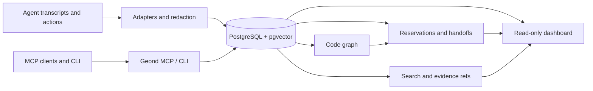

> Sprache: [English](README.md) | [한국어](README.ko.md) | [日本語](README.ja.md) | [简体中文](README.zh-CN.md) | [Español](README.es.md) | [Français](README.fr.md) | **Deutsch**

# Geond Agent Protocol

[](https://github.com/geondongkim/geond-agent-protocol/actions/workflows/ci.yml)
[](LICENSE)
[](pyproject.toml)

Geteiltes Gedächtnis und Koordination für AI agents, die im selben Repository arbeiten.

Geond gibt Copilot Chat, Codex, Claude Code, Antigravity, Manus, CLI agents und MCP-fähigen Tools einen dauerhaften Ort, um zu teilen, was passiert ist, warum es passiert ist, was geändert wurde, was reserviert ist, wie es validiert wurde und was der nächste agent oder reviewer tun sollte.


Geond ist standardmäßig local-first. Editor, CLI, MCP server, dashboard und importers können lokal gegen PostgreSQL laufen. Wenn ein Team über mehrere Maschinen zusammenarbeiten will, können dieselben lokalen Prozesse auf ein gemeinsames PostgreSQL-compatible profile wie Azure Database for PostgreSQL zeigen.

Geond ist alpha software. Repository-centered memory, MCP, CLI, dashboard read models, reservations, handoffs, code graph indexing, usage evidence, benchmarks und shared PostgreSQL validation sind heute implementiert. Enterprise IAM, row-level security, dedicated MCP audit streams, breite SaaS adapters und dependency-expanded automatic reservations stehen auf der roadmap.

> Zum Namen: Geond ist von einer altenglischen Wurzel von "beyond" inspiriert und wird "Jee-ond" ausgesprochen. Das Projekt hilft agents, über stateless prompts hinauszugehen, indem es sie mit überprüfbarem shared memory verbindet.

## Quick Start

Prerequisites: Python 3.11+, `uv`, Docker with Compose, Git und ripgrep. OS-spezifische Hinweise stehen in [docs/developer_setup.md](docs/developer_setup.md).

```bash
cp .env.example .env
uv sync
docker compose up -d postgres
docker compose --profile tools run --rm geond-migrate
uv run geond doctor --format text
uv run geond seed-sample
uv run geond mcp-smoke --format text --strict
```

MCP server starten:

```bash
uv run geond-mcp
```

MCP client config anzeigen oder schreiben:

```bash
uv run geond install --format text
uv run geond install --write
```

Read-only dashboard starten:

```bash
uv run geond dashboard serve
```

Öffne die ausgegebene localhost URL. Weitere MCP client Beispiele stehen in [docs/mcp_client_config.md](docs/mcp_client_config.md).

## What Geond Makes Possible

| Scenario | What you can do | Proof and entrypoint |
| --- | --- | --- |
| AI pair coding across agent tools | Verschiedene agent tools können im selben repo über shared memory, reservations, handoffs und review context zusammenarbeiten. Lokal mit Codex und Antigravity validiert; dasselbe Muster passt zu Copilot, Claude Code, Continue, Manus oder custom MCP agents. | [docs/antigravity_codex_geond_verification.md](docs/antigravity_codex_geond_verification.md), [docs/mcp_client_config.md](docs/mcp_client_config.md) |
| Multi-PC collaboration | `geond-mcp`, CLI und dashboard laufen lokal auf jeder Maschine, während Windows, MacBook, CI oder ein anderer teammate dasselbe shared PostgreSQL profile lesen und schreiben. | [docs/azure_validation/team_collab_validation.md](docs/azure_validation/team_collab_validation.md), [docs/azure_validation/README.md](docs/azure_validation/README.md) |
| PM and reviewer dashboard | Agent lanes, sessions, handoffs, changesets, code risk, usage evidence, timeline und lineage prüfen, ohne raw MCP JSON zu lesen. | `uv run geond dashboard serve`, [docs/agent_activity_dashboard.md](docs/agent_activity_dashboard.md) |
| Safe parallel editing | Agents können context review durchführen, files oder symbols reservieren, changesets aufzeichnen und structured handoffs hinterlassen, bevor ein anderer agent dasselbe Ziel editiert. | [docs/agent_operating_loop.md](docs/agent_operating_loop.md), `uv run geond review-context ...` |
| Cross-agent memory import | Copilot Chat, Codex, Claude Code, Antigravity und Manus task evidence nach redaction in ein gemeinsames search/evidence model importieren. | [docs/agent_testbeds.md](docs/agent_testbeds.md), [docs/manus_integration.md](docs/manus_integration.md) |
| Compact MCP context | Snippets, evidence refs, scores und follow-up detail paths zurückgeben, statt standardmäßig raw transcripts in den LLM context zu schieben. | [tests/test_mcp_payload_budget.py](tests/test_mcp_payload_budget.py), [docs/ai_usage_observability.md](docs/ai_usage_observability.md) |

## Demo GIFs

Diese GIFs werden aus sanitized scenario text erzeugt, nicht aus private transcripts.

```bash
uv run python scripts/render_readme_gifs.py
```


Browser-verified dashboard captures und längere terminal demo notes stehen in [docs/public_demo_script.md](docs/public_demo_script.md).

## Learning Path

Starte mit [learn/README.md](learn/README.md), um geführte notebooks entlang der README-Szenarien zu verwenden.

| Lesson | Focus |
| --- | --- |
| [01 Local Shared Memory](learn/01_local_shared_memory.ipynb) | Lokales PostgreSQL starten, sample evidence seed'en, memory search und MCP smoke test ausführen. |
| [02 Handoffs And Reservations](learn/02_handoffs_and_reservations.ipynb) | Context review, symbol reservations, conflicts und handoff packets üben. |
| [03 AI Pair Coding Workflow](learn/03_ai_pair_coding_workflow.ipynb) | Evidence zwischen Agent A und Agent B über verschiedene agent tools teilen. |
| [04 Shared PostgreSQL Team Mode](learn/04_shared_postgres_team_mode.ipynb) | Optional shared PostgreSQL profiles für multi-PC collaboration verstehen. |

## How It Works



1. Memory: importers normalisieren sessions, events, messages, usage records und task history aus agent tools und redacten common secrets vor dem Speichern.
1. Code graph: Python-, TypeScript- und JavaScript-indexers verbinden files, symbols, imports, calls, references und changesets.
1. Reservations: agents können files oder symbols mit TTL, policy checks, renewals, releases und auditable reservation events claimen.
1. Handoffs: agents hinterlassen next-action packets mit tested commands, blockers, remaining risks und evidence refs.
1. Dashboard: humans und PM/orchestrator agents lesen overview, activity, timeline, code risk, usage, lineage, reservations und handoff read models.
1. Shared PostgreSQL: local-first setups nutzen Docker PostgreSQL; team profiles können auf Azure oder ein anderes PostgreSQL-compatible backend zeigen.

## Common Workflows

| Goal | Command or doc |
| --- | --- |
| Check environment | `uv run geond doctor --format text` |
| Import Copilot Chat | `uv run geond import-vscode <workspaceStorage-or-session-path>` |
| Import Codex | `uv run geond import-codex <codex-sessions-dir> --workspace-uri <uri>` |
| Import Claude Code | `uv run geond import-claude-code <claude-projects-dir> --workspace-uri <uri>` |
| Import Antigravity | `uv run geond import-antigravity <storage-path> --workspace-uri <uri>` |
| Import Manus task | `uv run geond import-manus-task <task-id> --workspace-uri <uri>` |
| Search memory | `uv run geond search "why did this change" --mode hybrid` |
| Index code | `uv run geond index-tree-sitter <path>` |
| Record a changeset | `uv run geond record-changeset <workspace-id-or-uri> ...` |
| Reserve work | `uv run geond reserve-files ...` or `uv run geond reserve-symbols ...` |
| Review conflicts | `uv run geond review-context <workspace-id-or-uri> --format markdown` |
| Leave handoff | `uv run geond record-handoff <workspace-id-or-uri> ...` |
| Agent operating loop | [docs/agent_operating_loop.md](docs/agent_operating_loop.md) |
| MCP clients | [docs/mcp_client_config.md](docs/mcp_client_config.md) |

Für einen vollständigeren demo path siehe [docs/demo.md](docs/demo.md).

## Shared Team Database

Nutze `GEOND_DATABASE_URL` für die lokale default database. Um lokale Prozesse beizubehalten, aber memory über mehrere Maschinen zu teilen, füge ein zweites profile hinzu:

```bash
GEOND_DATABASE_PROFILE=azure
AZURE_GEOND_DATABASE_URL=postgresql://...
```

Das dashboard klassifiziert die aktive Quelle als local PostgreSQL, Azure PostgreSQL oder remote PostgreSQL, ohne user info, passwords oder tokens anzuzeigen. Der validierte team flow ist in [docs/azure_validation/team_collab_validation.md](docs/azure_validation/team_collab_validation.md) dokumentiert.

## Documentation

- [docs/architecture.md](docs/architecture.md): system layers und data model.
- [docs/agent_activity_dashboard.md](docs/agent_activity_dashboard.md): dashboard read models und PM/orchestrator views.
- [docs/agent_operating_loop.md](docs/agent_operating_loop.md): read, reserve, record und handoff loop für agents.
- [docs/agent_testbeds.md](docs/agent_testbeds.md): Copilot Chat, Codex, Claude Code und Antigravity test beds.
- [docs/manus_integration.md](docs/manus_integration.md): Manus API v2 import, context packets, task contracts und limitations.
- [docs/mcp_client_config.md](docs/mcp_client_config.md): VS Code, Claude Desktop, Continue, Antigravity und andere MCP client setup.
- [learn/README.md](learn/README.md): notebook-based onboarding path.

## Security And Privacy

Geond ist für local-first use gebaut. Importers redacten common secrets vor persistence, external embeddings sind opt-in, und das dashboard vermeidet credential-bearing connection strings. Trotzdem können agent transcripts sensitive information enthalten. Prüfe `.env`, transcripts, screenshots, benchmark logs und dashboard captures vor dem Teilen.

## License

Apache-2.0. See [LICENSE](LICENSE).
