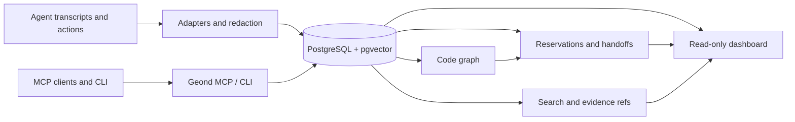

> Idioma: [English](README.md) | [한국어](README.ko.md) | [日本語](README.ja.md) | [简体中文](README.zh-CN.md) | **Español** | [Français](README.fr.md) | [Deutsch](README.de.md)

# Geond Agent Protocol

[](https://github.com/geondongkim/geond-agent-protocol/actions/workflows/ci.yml)
[](LICENSE)
[](pyproject.toml)

Memoria compartida y coordinación para AI agents que trabajan en el mismo repositorio.

Geond da a Copilot Chat, Codex, Claude Code, Antigravity, Manus, CLI agents y herramientas compatibles con MCP un lugar durable para compartir qué ocurrió, por qué ocurrió, qué cambió, qué está reservado, cómo se validó y qué debería hacer el siguiente agent o reviewer.


Geond es local-first por defecto. Tu editor, CLI, MCP server, dashboard e importers pueden ejecutarse en tu máquina contra PostgreSQL local. Cuando un equipo necesita colaboración entre varias máquinas, esos mismos procesos locales pueden apuntar a un perfil PostgreSQL-compatible compartido, como Azure Database for PostgreSQL.

Geond es alpha software. Repository-centered memory, MCP, CLI, dashboard read models, reservations, handoffs, code graph indexing, usage evidence, benchmarks y shared PostgreSQL validation ya están implementados. Enterprise IAM, row-level security, dedicated MCP audit streams, adapters SaaS más amplios y dependency-expanded automatic reservations están en roadmap.

> Sobre el nombre: Geond se inspira en una raíz del inglés antiguo relacionada con "beyond" y se pronuncia "Jee-ond". El proyecto ayuda a los agents a ir más allá de prompts sin estado conectándolos a memoria compartida inspeccionable.

## Quick Start

Prerequisites: Python 3.11+, `uv`, Docker with Compose, Git y ripgrep. Consulta [docs/developer_setup.md](docs/developer_setup.md) para notas por sistema operativo.

```bash
cp .env.example .env
uv sync
docker compose up -d postgres
docker compose --profile tools run --rm geond-migrate
uv run geond doctor --format text
uv run geond seed-sample
uv run geond mcp-smoke --format text --strict
```

Inicia el MCP server:

```bash
uv run geond-mcp
```

Previsualiza o escribe la configuración del MCP client:

```bash
uv run geond install --format text
uv run geond install --write
```

Sirve el dashboard de solo lectura:

```bash
uv run geond dashboard serve
```

Abre la URL localhost que se imprime. Hay más ejemplos de MCP clients en [docs/mcp_client_config.md](docs/mcp_client_config.md).

## What Geond Makes Possible

| Scenario | What you can do | Proof and entrypoint |
| --- | --- | --- |
| AI pair coding across agent tools | Permite que distintos agent tools trabajen en el mismo repo usando shared memory, reservations, handoffs y review context. Validado localmente con Codex y Antigravity; el mismo patrón aplica a Copilot, Claude Code, Continue, Manus o custom MCP agents. | [docs/antigravity_codex_geond_verification.md](docs/antigravity_codex_geond_verification.md), [docs/mcp_client_config.md](docs/mcp_client_config.md) |
| Multi-PC collaboration | Ejecuta `geond-mcp`, CLI y dashboard localmente en cada máquina mientras Windows, MacBook, CI u otro teammate leen y escriben el mismo shared PostgreSQL profile. | [docs/azure_validation/team_collab_validation.md](docs/azure_validation/team_collab_validation.md), [docs/azure_validation/README.md](docs/azure_validation/README.md) |
| PM and reviewer dashboard | Revisa agent lanes, sessions, handoffs, changesets, code risk, usage evidence, timeline y lineage sin leer raw MCP JSON. | `uv run geond dashboard serve`, [docs/agent_activity_dashboard.md](docs/agent_activity_dashboard.md) |
| Safe parallel editing | Pide a los agents revisar contexto, reservar files o symbols, registrar changesets y dejar handoffs estructurados antes de que otro agent edite el mismo objetivo. | [docs/agent_operating_loop.md](docs/agent_operating_loop.md), `uv run geond review-context ...` |
| Cross-agent memory import | Importa evidencia de tareas de Copilot Chat, Codex, Claude Code, Antigravity y Manus en un único modelo de search/evidence con redaction. | [docs/agent_testbeds.md](docs/agent_testbeds.md), [docs/manus_integration.md](docs/manus_integration.md) |
| Compact MCP context | Devuelve snippets, evidence refs, scores y follow-up detail paths en vez de inundar el LLM con raw transcripts por defecto. | [tests/test_mcp_payload_budget.py](tests/test_mcp_payload_budget.py), [docs/ai_usage_observability.md](docs/ai_usage_observability.md) |

## Demo GIFs

Estos GIFs se generan desde sanitized scenario text, no desde private transcripts.

```bash
uv run python scripts/render_readme_gifs.py
```


Para capturas del dashboard verificadas en navegador y notas de terminal más largas, consulta [docs/public_demo_script.md](docs/public_demo_script.md).

## Learning Path

Empieza con [learn/README.md](learn/README.md) para notebooks guiados que siguen los escenarios del README.

| Lesson | Focus |
| --- | --- |
| [01 Local Shared Memory](learn/01_local_shared_memory.ipynb) | Ejecuta PostgreSQL local, carga sample evidence, busca en memory y prueba MCP smoke. |
| [02 Handoffs And Reservations](learn/02_handoffs_and_reservations.ipynb) | Practica context review, symbol reservations, conflicts y handoff packets. |
| [03 AI Pair Coding Workflow](learn/03_ai_pair_coding_workflow.ipynb) | Comparte evidence entre Agent A y Agent B usando diferentes agent tools. |
| [04 Shared PostgreSQL Team Mode](learn/04_shared_postgres_team_mode.ipynb) | Entiende optional shared PostgreSQL profiles para colaboración multi-PC. |

## How It Works



1. Memory: importers normalizan sessions, events, messages, usage records y task history desde agent tools, y redactan common secrets antes de persistir.
1. Code graph: indexers de Python, TypeScript y JavaScript conectan files, symbols, imports, calls, references y changesets.
1. Reservations: agents pueden reclamar files o symbols con TTL, policy checks, renewals, releases y auditable reservation events.
1. Handoffs: agents dejan next-action packets con tested commands, blockers, remaining risks y evidence refs.
1. Dashboard: humans y PM/orchestrator agents leen overview, activity, timeline, code risk, usage, lineage, reservations y handoff read models.
1. Shared PostgreSQL: setups local-first usan Docker PostgreSQL; team profiles pueden apuntar a Azure u otro backend PostgreSQL-compatible.

## Common Workflows

| Goal | Command or doc |
| --- | --- |
| Check environment | `uv run geond doctor --format text` |
| Import Copilot Chat | `uv run geond import-vscode <workspaceStorage-or-session-path>` |
| Import Codex | `uv run geond import-codex <codex-sessions-dir> --workspace-uri <uri>` |
| Import Claude Code | `uv run geond import-claude-code <claude-projects-dir> --workspace-uri <uri>` |
| Import Antigravity | `uv run geond import-antigravity <storage-path> --workspace-uri <uri>` |
| Import Manus task | `uv run geond import-manus-task <task-id> --workspace-uri <uri>` |
| Search memory | `uv run geond search "why did this change" --mode hybrid` |
| Index code | `uv run geond index-tree-sitter <path>` |
| Record a changeset | `uv run geond record-changeset <workspace-id-or-uri> ...` |
| Reserve work | `uv run geond reserve-files ...` or `uv run geond reserve-symbols ...` |
| Review conflicts | `uv run geond review-context <workspace-id-or-uri> --format markdown` |
| Leave handoff | `uv run geond record-handoff <workspace-id-or-uri> ...` |
| Agent operating loop | [docs/agent_operating_loop.md](docs/agent_operating_loop.md) |
| MCP clients | [docs/mcp_client_config.md](docs/mcp_client_config.md) |

Para un demo path más completo, consulta [docs/demo.md](docs/demo.md).

## Shared Team Database

Usa `GEOND_DATABASE_URL` para la base local por defecto. Para mantener procesos locales pero compartir memory entre máquinas, agrega un segundo profile:

```bash
GEOND_DATABASE_PROFILE=azure
AZURE_GEOND_DATABASE_URL=postgresql://...
```

El dashboard clasifica la fuente activa como local PostgreSQL, Azure PostgreSQL o remote PostgreSQL sin mostrar user info, passwords ni tokens. El flujo validado de equipo está documentado en [docs/azure_validation/team_collab_validation.md](docs/azure_validation/team_collab_validation.md).

## Documentation

- [docs/architecture.md](docs/architecture.md): system layers y data model.
- [docs/agent_activity_dashboard.md](docs/agent_activity_dashboard.md): dashboard read models y PM/orchestrator views.
- [docs/agent_operating_loop.md](docs/agent_operating_loop.md): read, reserve, record y handoff loop para agents.
- [docs/agent_testbeds.md](docs/agent_testbeds.md): test beds para Copilot Chat, Codex, Claude Code y Antigravity.
- [docs/manus_integration.md](docs/manus_integration.md): Manus API v2 import, context packets, task contracts y limitations.
- [docs/mcp_client_config.md](docs/mcp_client_config.md): setup para VS Code, Claude Desktop, Continue, Antigravity y otros MCP clients.
- [learn/README.md](learn/README.md): notebook-based onboarding path.

## Security And Privacy

Geond está diseñado para uso local-first. Importers redactan common secrets antes de persistir, external embeddings son opt-in y el dashboard evita exponer credential-bearing connection strings. Aun así, los agent transcripts pueden contener información sensible. Revisa `.env`, transcripts, screenshots, benchmark logs y dashboard captures antes de compartirlos.

## License

Apache-2.0. See [LICENSE](LICENSE).
