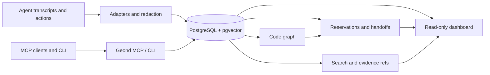

> Langue: [English](README.md) | [한국어](README.ko.md) | [日本語](README.ja.md) | [简体中文](README.zh-CN.md) | [Español](README.es.md) | **Français** | [Deutsch](README.de.md)

# Geond Agent Protocol

[](https://github.com/geondongkim/geond-agent-protocol/actions/workflows/ci.yml)
[](LICENSE)
[](pyproject.toml)

Mémoire partagée et coordination pour des AI agents qui travaillent sur le même dépôt.

Geond donne à Copilot Chat, Codex, Claude Code, Antigravity, Manus, CLI agents et aux outils compatibles MCP un endroit durable pour partager ce qui s'est passé, pourquoi cela s'est passé, ce qui a changé, ce qui est réservé, comment cela a été validé et ce que le prochain agent ou reviewer doit faire.


Geond est local-first par défaut. Votre éditeur, CLI, MCP server, dashboard et importers peuvent tourner sur votre machine avec PostgreSQL local. Quand une équipe veut collaborer sur plusieurs machines, ces mêmes processus locaux peuvent pointer vers un profil PostgreSQL-compatible partagé, par exemple Azure Database for PostgreSQL.

Geond est alpha software. La memory centrée dépôt, MCP, CLI, dashboard read models, reservations, handoffs, code graph indexing, usage evidence, benchmarks et shared PostgreSQL validation sont implémentés aujourd'hui. Enterprise IAM, row-level security, dedicated MCP audit streams, adapters SaaS plus larges et dependency-expanded automatic reservations sont dans la roadmap.

> À propos du nom: Geond vient d'une racine du vieil anglais liée à "beyond" et se prononce "Jee-ond". Le projet aide les agents à aller au-delà des prompts sans état en les connectant à une mémoire partagée inspectable.

## Quick Start

Prerequisites: Python 3.11+, `uv`, Docker with Compose, Git et ripgrep. Voir [docs/developer_setup.md](docs/developer_setup.md) pour les notes par OS.

```bash
cp .env.example .env
uv sync
docker compose up -d postgres
docker compose --profile tools run --rm geond-migrate
uv run geond doctor --format text
uv run geond seed-sample
uv run geond mcp-smoke --format text --strict
```

Démarrer le MCP server:

```bash
uv run geond-mcp
```

Prévisualiser ou écrire la configuration MCP client:

```bash
uv run geond install --format text
uv run geond install --write
```

Servir le dashboard en lecture seule:

```bash
uv run geond dashboard serve
```

Ouvrez l'URL localhost affichée. D'autres exemples MCP client sont dans [docs/mcp_client_config.md](docs/mcp_client_config.md).

## What Geond Makes Possible

| Scenario | What you can do | Proof and entrypoint |
| --- | --- | --- |
| AI pair coding across agent tools | Permettre à différents agent tools de travailler sur le même repo avec shared memory, reservations, handoffs et review context. Validé localement avec Codex et Antigravity; le même pattern s'applique à Copilot, Claude Code, Continue, Manus ou custom MCP agents. | [docs/antigravity_codex_geond_verification.md](docs/antigravity_codex_geond_verification.md), [docs/mcp_client_config.md](docs/mcp_client_config.md) |
| Multi-PC collaboration | Exécuter `geond-mcp`, CLI et dashboard localement sur chaque machine pendant que Windows, MacBook, CI ou un autre teammate lisent et écrivent le même shared PostgreSQL profile. | [docs/azure_validation/team_collab_validation.md](docs/azure_validation/team_collab_validation.md), [docs/azure_validation/README.md](docs/azure_validation/README.md) |
| PM and reviewer dashboard | Examiner agent lanes, sessions, handoffs, changesets, code risk, usage evidence, timeline et lineage sans lire du raw MCP JSON. | `uv run geond dashboard serve`, [docs/agent_activity_dashboard.md](docs/agent_activity_dashboard.md) |
| Safe parallel editing | Demander aux agents de review le context, reserve files ou symbols, record changesets et laisser des handoffs structurés avant qu'un autre agent édite la même cible. | [docs/agent_operating_loop.md](docs/agent_operating_loop.md), `uv run geond review-context ...` |
| Cross-agent memory import | Importer Copilot Chat, Codex, Claude Code, Antigravity et Manus task evidence dans un même search/evidence model après redaction. | [docs/agent_testbeds.md](docs/agent_testbeds.md), [docs/manus_integration.md](docs/manus_integration.md) |
| Compact MCP context | Retourner snippets, evidence refs, scores et follow-up detail paths au lieu d'inonder le LLM avec des raw transcripts par défaut. | [tests/test_mcp_payload_budget.py](tests/test_mcp_payload_budget.py), [docs/ai_usage_observability.md](docs/ai_usage_observability.md) |

## Demo GIFs

Ces GIFs sont générés à partir de sanitized scenario text, pas de private transcripts.

```bash
uv run python scripts/render_readme_gifs.py
```


Pour des captures dashboard vérifiées au navigateur et des notes terminal plus longues, voir [docs/public_demo_script.md](docs/public_demo_script.md).

## Learning Path

Commencez avec [learn/README.md](learn/README.md) pour des notebooks guidés qui suivent les scénarios du README.

| Lesson | Focus |
| --- | --- |
| [01 Local Shared Memory](learn/01_local_shared_memory.ipynb) | Lancer PostgreSQL local, seed sample evidence, search memory et exécuter MCP smoke test. |
| [02 Handoffs And Reservations](learn/02_handoffs_and_reservations.ipynb) | Pratiquer context review, symbol reservations, conflicts et handoff packets. |
| [03 AI Pair Coding Workflow](learn/03_ai_pair_coding_workflow.ipynb) | Partager evidence entre Agent A et Agent B avec différents agent tools. |
| [04 Shared PostgreSQL Team Mode](learn/04_shared_postgres_team_mode.ipynb) | Comprendre les optional shared PostgreSQL profiles pour collaboration multi-PC. |

## How It Works



1. Memory: les importers normalisent sessions, events, messages, usage records et task history depuis les agent tools, puis redacted common secrets avant persistence.
1. Code graph: les indexers Python, TypeScript et JavaScript connectent files, symbols, imports, calls, references et changesets.
1. Reservations: les agents peuvent claim files ou symbols avec TTL, policy checks, renewals, releases et auditable reservation events.
1. Handoffs: les agents laissent des next-action packets avec tested commands, blockers, remaining risks et evidence refs.
1. Dashboard: humans et PM/orchestrator agents lisent overview, activity, timeline, code risk, usage, lineage, reservations et handoff read models.
1. Shared PostgreSQL: les setups local-first utilisent Docker PostgreSQL; les team profiles peuvent pointer vers Azure ou un autre backend PostgreSQL-compatible.

## Common Workflows

| Goal | Command or doc |
| --- | --- |
| Check environment | `uv run geond doctor --format text` |
| Import Copilot Chat | `uv run geond import-vscode <workspaceStorage-or-session-path>` |
| Import Codex | `uv run geond import-codex <codex-sessions-dir> --workspace-uri <uri>` |
| Import Claude Code | `uv run geond import-claude-code <claude-projects-dir> --workspace-uri <uri>` |
| Import Antigravity | `uv run geond import-antigravity <storage-path> --workspace-uri <uri>` |
| Import Manus task | `uv run geond import-manus-task <task-id> --workspace-uri <uri>` |
| Search memory | `uv run geond search "why did this change" --mode hybrid` |
| Index code | `uv run geond index-tree-sitter <path>` |
| Record a changeset | `uv run geond record-changeset <workspace-id-or-uri> ...` |
| Reserve work | `uv run geond reserve-files ...` or `uv run geond reserve-symbols ...` |
| Review conflicts | `uv run geond review-context <workspace-id-or-uri> --format markdown` |
| Leave handoff | `uv run geond record-handoff <workspace-id-or-uri> ...` |
| Agent operating loop | [docs/agent_operating_loop.md](docs/agent_operating_loop.md) |
| MCP clients | [docs/mcp_client_config.md](docs/mcp_client_config.md) |

Pour un demo path plus complet, voir [docs/demo.md](docs/demo.md).

## Shared Team Database

Utilisez `GEOND_DATABASE_URL` pour la database locale par défaut. Pour garder des processus locaux tout en partageant la memory entre machines, ajoutez un second profile:

```bash
GEOND_DATABASE_PROFILE=azure
AZURE_GEOND_DATABASE_URL=postgresql://...
```

Le dashboard classe la source active comme local PostgreSQL, Azure PostgreSQL ou remote PostgreSQL sans afficher user info, passwords ou tokens. Le team flow validé est documenté dans [docs/azure_validation/team_collab_validation.md](docs/azure_validation/team_collab_validation.md).

## Documentation

- [docs/architecture.md](docs/architecture.md): system layers et data model.
- [docs/agent_activity_dashboard.md](docs/agent_activity_dashboard.md): dashboard read models et PM/orchestrator views.
- [docs/agent_operating_loop.md](docs/agent_operating_loop.md): read, reserve, record et handoff loop pour agents.
- [docs/agent_testbeds.md](docs/agent_testbeds.md): test beds Copilot Chat, Codex, Claude Code et Antigravity.
- [docs/manus_integration.md](docs/manus_integration.md): Manus API v2 import, context packets, task contracts et limitations.
- [docs/mcp_client_config.md](docs/mcp_client_config.md): setup VS Code, Claude Desktop, Continue, Antigravity et autres MCP clients.
- [learn/README.md](learn/README.md): notebook-based onboarding path.

## Security And Privacy

Geond est conçu pour un usage local-first. Les importers redact common secrets avant persistence, external embeddings est opt-in et le dashboard évite d'exposer des credential-bearing connection strings. Même ainsi, les agent transcripts peuvent contenir des informations sensibles. Vérifiez `.env`, transcripts, screenshots, benchmark logs et dashboard captures avant partage.

## License

Apache-2.0. See [LICENSE](LICENSE).
