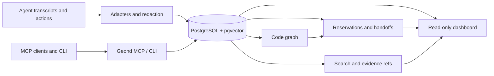

> 言語: [English](README.md) | [한국어](README.ko.md) | **日本語** | [简体中文](README.zh-CN.md) | [Español](README.es.md) | [Français](README.fr.md) | [Deutsch](README.de.md)

# Geond Agent Protocol

[](https://github.com/geondongkim/geond-agent-protocol/actions/workflows/ci.yml)
[](LICENSE)
[](pyproject.toml)

同じリポジトリで作業する AI エージェントのための共有メモリと協調レイヤーです。

Geond は Copilot Chat、Codex、Claude Code、Antigravity、Manus、CLI agents、
MCP 対応ツールが、何が起きたか、なぜそうしたか、何が変更されたか、何が予約されているか、どう検証されたか、次のエージェントやレビュー担当者が何を見るべきかを、永続的な evidence layer に残せるようにします。


Geond はデフォルトで local-first です。エディタ、CLI、MCP server、dashboard、importer はローカル PostgreSQL に対して実行できます。チームが複数マシンで協働したい場合も、同じローカルプロセスを Azure Database for PostgreSQL などの共有 PostgreSQL 互換プロファイルに向けられます。

Geond は alpha software です。リポジトリ中心の memory、MCP、CLI、dashboard read model、reservation、handoff、code graph indexing、usage evidence、benchmark、shared PostgreSQL validation は現在実装されています。Enterprise IAM、row-level security、専用 MCP audit stream、広範な SaaS adapter、dependency-expanded automatic reservation は roadmap 領域です。

> 名前について: Geond は "beyond" の古英語の語根に着想を得ており、"Jee-ond" と発音します。このプロジェクトは、エージェントが stateless prompt を超えて、検査可能な共有メモリにつながることを助けます。

## Quick Start

Prerequisites: Python 3.11+, `uv`, Docker with Compose, Git, ripgrep. OS 別のメモは [docs/developer_setup.md](docs/developer_setup.md) を参照してください。

```bash
cp .env.example .env
uv sync
docker compose up -d postgres
docker compose --profile tools run --rm geond-migrate
uv run geond doctor --format text
uv run geond seed-sample
uv run geond mcp-smoke --format text --strict
```

MCP server を起動します。

```bash
uv run geond-mcp
```

MCP client config をプレビューまたは書き込みます。

```bash
uv run geond install --format text
uv run geond install --write
```

読み取り専用 dashboard を起動します。

```bash
uv run geond dashboard serve
```

表示された localhost URL を開いてください。MCP client の例は [docs/mcp_client_config.md](docs/mcp_client_config.md) にあります。

## What Geond Makes Possible

| Scenario | What you can do | Proof and entrypoint |
| --- | --- | --- |
| AI pair coding across agent tools | 異なるエージェントツールが同じリポジトリで作業するとき、shared memory、reservation、handoff、review context によってペアコーディングと役割分担ができます。Codex と Antigravity でローカル検証済みで、同じパターンは Copilot、Claude Code、Continue、Manus、custom MCP agent にも適用できます。 | [docs/antigravity_codex_geond_verification.md](docs/antigravity_codex_geond_verification.md), [docs/mcp_client_config.md](docs/mcp_client_config.md) |
| Multi-PC collaboration | Windows、MacBook、CI、別のチームメイトが、それぞれローカルで `geond-mcp`、CLI、dashboard を実行しながら、同じ共有 PostgreSQL プロファイルを読み書きできます。 | [docs/azure_validation/team_collab_validation.md](docs/azure_validation/team_collab_validation.md), [docs/azure_validation/README.md](docs/azure_validation/README.md) |
| PM and reviewer dashboard | raw MCP JSON を読まなくても、agent lane、session、handoff、changeset、code risk、usage evidence、timeline、lineage を確認できます。 | `uv run geond dashboard serve`, [docs/agent_activity_dashboard.md](docs/agent_activity_dashboard.md) |
| Safe parallel editing | エージェントに context review、file/symbol reservation、changeset 記録、構造化 handoff を行わせ、同じ対象への衝突を事前に把握できます。 | [docs/agent_operating_loop.md](docs/agent_operating_loop.md), `uv run geond review-context ...` |
| Cross-agent memory import | Copilot Chat、Codex、Claude Code、Antigravity、Manus の task evidence を redaction 後に 1 つの検索/evidence model に取り込めます。 | [docs/agent_testbeds.md](docs/agent_testbeds.md), [docs/manus_integration.md](docs/manus_integration.md) |
| Compact MCP context | raw transcript をそのまま流し込まず、snippet、evidence ref、score、detail path 中心で返すことで LLM context cost を抑えます。 | [tests/test_mcp_payload_budget.py](tests/test_mcp_payload_budget.py), [docs/ai_usage_observability.md](docs/ai_usage_observability.md) |

## Demo GIFs

これらの GIF は private transcript ではなく、sanitized scenario text から生成されています。

```bash
uv run python scripts/render_readme_gifs.py
```


browser-verified dashboard capture と長い terminal demo notes は [docs/public_demo_script.md](docs/public_demo_script.md) を参照してください。

## Learning Path

README のシナリオに沿った notebook onboarding は [learn/README.md](learn/README.md) から始められます。

| Lesson | Focus |
| --- | --- |
| [01 Local Shared Memory](learn/01_local_shared_memory.ipynb) | ローカル PostgreSQL を起動し、sample evidence を seed し、memory search と MCP smoke test を実行します。 |
| [02 Handoffs And Reservations](learn/02_handoffs_and_reservations.ipynb) | context review、symbol reservation、conflict、handoff packet を練習します。 |
| [03 AI Pair Coding Workflow](learn/03_ai_pair_coding_workflow.ipynb) | Agent A と Agent B が別々の agent tool を使いながら evidence を共有する流れを学びます。 |
| [04 Shared PostgreSQL Team Mode](learn/04_shared_postgres_team_mode.ipynb) | 複数 PC 協働のための optional shared PostgreSQL profile を理解します。 |

## How It Works



1. Memory: importer が agent tool の session、event、message、usage record、task history を正規化し、common secrets を redaction して保存します。
1. Code graph: Python、TypeScript、JavaScript indexer が file、symbol、import、call、reference、changeset を接続します。
1. Reservations: agent は TTL、policy check、renewal、release、audit event 付きの file/symbol claim を作成できます。
1. Handoffs: agent は tested command、blocker、remaining risk、evidence ref を含む next-action packet を残します。
1. Dashboard: human reviewer と PM/orchestrator agent が overview、activity、timeline、code risk、usage、lineage、reservation、handoff read model を確認します。
1. Shared PostgreSQL: local-first setup は Docker PostgreSQL を使い、team profile は Azure または他の PostgreSQL-compatible backend を指せます。

## Common Workflows

| Goal | Command or doc |
| --- | --- |
| Check environment | `uv run geond doctor --format text` |
| Import Copilot Chat | `uv run geond import-vscode <workspaceStorage-or-session-path>` |
| Import Codex | `uv run geond import-codex <codex-sessions-dir> --workspace-uri <uri>` |
| Import Claude Code | `uv run geond import-claude-code <claude-projects-dir> --workspace-uri <uri>` |
| Import Antigravity | `uv run geond import-antigravity <storage-path> --workspace-uri <uri>` |
| Import Manus task | `uv run geond import-manus-task <task-id> --workspace-uri <uri>` |
| Search memory | `uv run geond search "why did this change" --mode hybrid` |
| Index code | `uv run geond index-tree-sitter <path>` |
| Record a changeset | `uv run geond record-changeset <workspace-id-or-uri> ...` |
| Reserve work | `uv run geond reserve-files ...` or `uv run geond reserve-symbols ...` |
| Review conflicts | `uv run geond review-context <workspace-id-or-uri> --format markdown` |
| Leave handoff | `uv run geond record-handoff <workspace-id-or-uri> ...` |
| Agent operating loop | [docs/agent_operating_loop.md](docs/agent_operating_loop.md) |
| MCP clients | [docs/mcp_client_config.md](docs/mcp_client_config.md) |

より完全な demo path は [docs/demo.md](docs/demo.md) にあります。

## Shared Team Database

デフォルトのローカル database には `GEOND_DATABASE_URL` を使います。ローカルプロセスを保ったまま複数マシンで memory を共有するには、2 つ目の profile を追加します。

```bash
GEOND_DATABASE_PROFILE=azure
AZURE_GEOND_DATABASE_URL=postgresql://...
```

Dashboard は user info、password、token を表示せず、active source を local PostgreSQL、Azure PostgreSQL、remote PostgreSQL として分類します。検証済みの team flow は [docs/azure_validation/team_collab_validation.md](docs/azure_validation/team_collab_validation.md) にあります。

## Documentation

- [docs/architecture.md](docs/architecture.md): system layer と data model.
- [docs/agent_activity_dashboard.md](docs/agent_activity_dashboard.md): dashboard read model と PM/orchestrator view.
- [docs/agent_operating_loop.md](docs/agent_operating_loop.md): agent の read、reserve、record、handoff loop.
- [docs/agent_testbeds.md](docs/agent_testbeds.md): Copilot Chat、Codex、Claude Code、Antigravity test bed.
- [docs/manus_integration.md](docs/manus_integration.md): Manus API v2 import、context packet、task contract、limitation.
- [docs/mcp_client_config.md](docs/mcp_client_config.md): VS Code、Claude Desktop、Continue、Antigravity などの MCP client setup.
- [learn/README.md](learn/README.md): notebook-based onboarding path.

## Security And Privacy

Geond は local-first use を前提に設計されています。Importer は保存前に common secrets を redaction し、external embeddings は opt-in で、dashboard は credential-bearing connection string を表示しません。それでも agent transcript には sensitive information が含まれることがあります。`.env`、transcript、screenshot、benchmark log、dashboard capture を共有前に確認してください。

## License

Apache-2.0. See [LICENSE](LICENSE).
