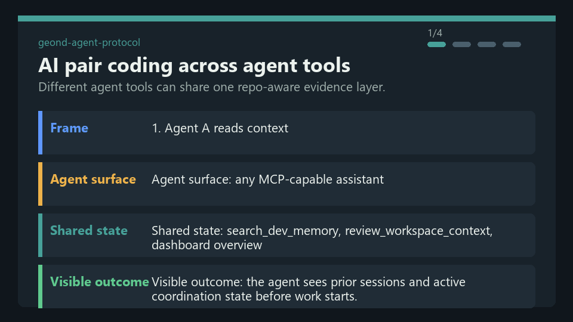
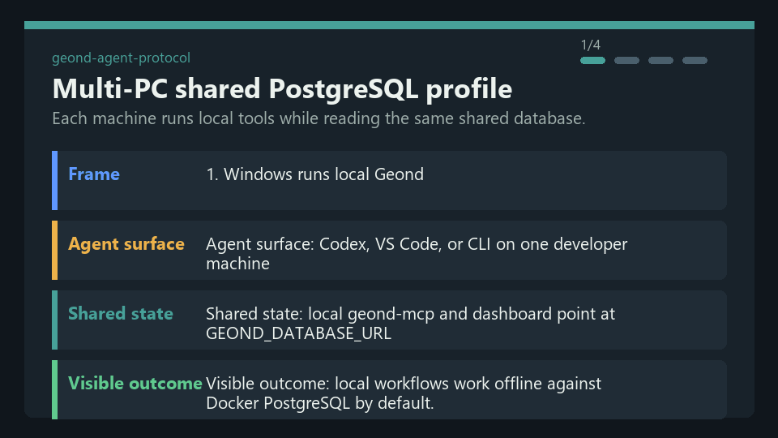
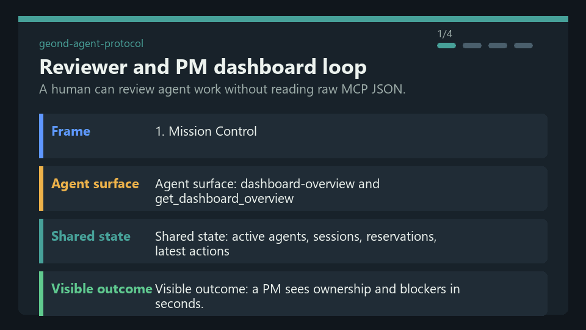
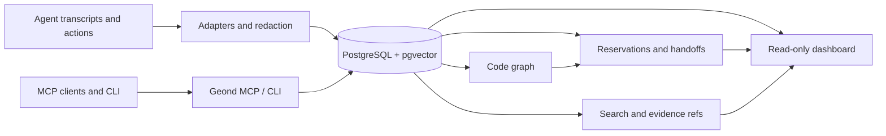

> 언어: [English](README.md) | **한국어** | [日本語](README.ja.md) | [简体中文](README.zh-CN.md) | [Español](README.es.md) | [Français](README.fr.md) | [Deutsch](README.de.md)

# Geond Agent Protocol

[](https://github.com/geondongkim/geond-agent-protocol/actions/workflows/ci.yml)
[](LICENSE)
[](pyproject.toml)

같은 저장소에서 일하는 AI 에이전트를 위한 공유 메모리와 협업 레이어입니다.

Geond는 Copilot Chat, Codex, Claude Code, Antigravity, Manus, CLI agent,
MCP 지원 도구가 "무슨 일이 있었는지", "왜 그렇게 했는지", "무엇이
바뀌었는지", "어떤 파일/심볼이 예약되어 있는지", "어떻게 검증했는지",
"다음 에이전트나 리뷰어가 무엇을 봐야 하는지"를 같은 evidence layer에
남기도록 돕습니다.



Geond는 기본적으로 local-first입니다. 에디터, CLI, MCP server, dashboard,
importer를 로컬 PostgreSQL 위에서 실행할 수 있습니다. 여러 PC가 함께
작업해야 할 때는 같은 로컬 프로세스들이 Azure Database for PostgreSQL 같은
공유 PostgreSQL 호환 프로필을 바라보게 만들 수 있습니다.

Geond는 alpha software입니다. 저장소 중심 memory, MCP, CLI, dashboard read
model, reservation, handoff, code graph indexing, usage evidence, benchmark,
shared PostgreSQL 검증 흐름은 현재 구현되어 있습니다. Enterprise IAM,
row-level security, 전용 MCP audit stream, 넓은 SaaS adapter, dependency 기반
자동 reservation 확장은 roadmap 영역입니다.

> 이름에 대해: Geond는 "beyond"의 옛 영어 어근에서 착안했고 "Jee-ond"처럼
> 발음합니다. 이 프로젝트는 에이전트가 stateless prompt를 넘어, 검토 가능한
> 공유 메모리와 연결되도록 돕습니다.

## Quick Start

필수 조건: Python 3.11+, `uv`, Docker with Compose, Git, ripgrep. OS별 설정은
[docs/developer_setup.md](docs/developer_setup.md)를 참고하세요.

```bash
cp .env.example .env
uv sync
docker compose up -d postgres
docker compose --profile tools run --rm geond-migrate
uv run geond doctor --format text
uv run geond seed-sample
uv run geond mcp-smoke --format text --strict
```

MCP server 실행:

```bash
uv run geond-mcp
```

MCP client 설정 미리보기 또는 쓰기:

```bash
uv run geond install --format text
uv run geond install --write
```

읽기 전용 dashboard 실행:

```bash
uv run geond dashboard serve
```

출력된 localhost URL을 열면 됩니다. MCP client별 예시는
[docs/mcp_client_config.md](docs/mcp_client_config.md)에 더 있습니다.

## What Geond Makes Possible

| Scenario | What you can do | Proof and entrypoint |
| --- | --- | --- |
| AI pair coding across agent tools | 서로 다른 에이전트 도구가 같은 저장소에서 작업할 때 shared memory, reservation, handoff, review context를 통해 페어코딩과 역할분담을 할 수 있습니다. Codex와 Antigravity로 로컬 검증했고, 같은 패턴은 Copilot, Claude Code, Continue, Manus, custom MCP agent에도 적용할 수 있습니다. | [docs/antigravity_codex_geond_verification.md](docs/antigravity_codex_geond_verification.md), [docs/mcp_client_config.md](docs/mcp_client_config.md) |
| Multi-PC collaboration | Windows, MacBook, CI, 다른 팀원이 각자 로컬에서 `geond-mcp`, CLI, dashboard를 실행하면서 같은 공유 PostgreSQL 프로필을 읽고 쓸 수 있습니다. | [docs/azure_validation/team_collab_validation.md](docs/azure_validation/team_collab_validation.md), [docs/azure_validation/README.md](docs/azure_validation/README.md) |
| PM and reviewer dashboard | 사람이 raw MCP JSON을 읽지 않고도 agent lane, session, handoff, changeset, code risk, usage evidence, timeline, lineage를 검토할 수 있습니다. | `uv run geond dashboard serve`, [docs/agent_activity_dashboard.md](docs/agent_activity_dashboard.md) |
| Safe parallel editing | 에이전트가 현재 context를 검토하고, 파일/심볼을 예약하고, changeset을 기록하고, 같은 대상에 다른 에이전트가 들어오기 전에 구조화된 handoff를 남기게 할 수 있습니다. | [docs/agent_operating_loop.md](docs/agent_operating_loop.md), `uv run geond review-context ...` |
| Cross-agent memory import | Copilot Chat, Codex, Claude Code, Antigravity, Manus 작업 evidence를 redaction 후 하나의 검색/evidence model로 가져올 수 있습니다. | [docs/agent_testbeds.md](docs/agent_testbeds.md), [docs/manus_integration.md](docs/manus_integration.md) |
| Compact MCP context | raw transcript를 기본으로 쏟아내지 않고 snippet, evidence ref, score, detail path 중심으로 반환해 LLM context 비용을 줄일 수 있습니다. | [tests/test_mcp_payload_budget.py](tests/test_mcp_payload_budget.py), [docs/ai_usage_observability.md](docs/ai_usage_observability.md) |

## Demo GIFs

이 GIF들은 private transcript가 아니라 sanitized scenario text에서 생성됩니다.
다음 명령으로 다시 생성할 수 있습니다.

```bash
uv run python scripts/render_readme_gifs.py
```





브라우저로 검증한 dashboard capture와 더 긴 terminal demo 메모는
[docs/public_demo_script.md](docs/public_demo_script.md)를 참고하세요.

## Learning Path

README의 시나리오를 따라가는 notebook 기반 onboarding은
[learn/README.md](learn/README.md)에서 시작하세요.

| Lesson | Focus |
| --- | --- |
| [01 Local Shared Memory](learn/01_local_shared_memory.ipynb) | 로컬 PostgreSQL을 실행하고 sample evidence를 seed한 뒤 memory search와 MCP smoke test를 해봅니다. |
| [02 Handoffs And Reservations](learn/02_handoffs_and_reservations.ipynb) | context review, symbol reservation, conflict, handoff packet 흐름을 연습합니다. |
| [03 AI Pair Coding Workflow](learn/03_ai_pair_coding_workflow.ipynb) | Agent A와 Agent B가 서로 다른 agent tool을 쓰면서 evidence를 공유하는 흐름을 봅니다. |
| [04 Shared PostgreSQL Team Mode](learn/04_shared_postgres_team_mode.ipynb) | 여러 PC 협업을 위한 선택형 shared PostgreSQL profile을 이해합니다. |

## How It Works



1. Memory: importer가 agent tool의 session, event, message, usage record, task history를 정규화하고 common secret을 redaction한 뒤 저장합니다.
1. Code graph: Python, TypeScript, JavaScript indexer가 file, symbol, import, call, reference, changeset을 연결합니다.
1. Reservations: agent는 TTL, policy check, renewal, release, audit event가 있는 file/symbol claim을 만들 수 있습니다.
1. Handoffs: agent는 tested command, blocker, remaining risk, evidence ref가 포함된 next-action packet을 남깁니다.
1. Dashboard: 사람과 PM/orchestrator agent는 overview, activity, timeline, code risk, usage, lineage, reservation, handoff read model을 봅니다.
1. Shared PostgreSQL: local-first setup은 Docker PostgreSQL을 쓰고, team profile은 Azure 또는 다른 PostgreSQL 호환 backend를 바라볼 수 있습니다.

## Common Workflows

| Goal | Command or doc |
| --- | --- |
| Check environment | `uv run geond doctor --format text` |
| Import Copilot Chat | `uv run geond import-vscode <workspaceStorage-or-session-path>` |
| Import Codex | `uv run geond import-codex <codex-sessions-dir> --workspace-uri <uri>` |
| Import Claude Code | `uv run geond import-claude-code <claude-projects-dir> --workspace-uri <uri>` |
| Import Antigravity | `uv run geond import-antigravity <storage-path> --workspace-uri <uri>` |
| Import Manus task | `uv run geond import-manus-task <task-id> --workspace-uri <uri>` |
| Search memory | `uv run geond search "why did this change" --mode hybrid` |
| Index code | `uv run geond index-tree-sitter <path>` |
| Record a changeset | `uv run geond record-changeset <workspace-id-or-uri> ...` |
| Reserve work | `uv run geond reserve-files ...` or `uv run geond reserve-symbols ...` |
| Review conflicts | `uv run geond review-context <workspace-id-or-uri> --format markdown` |
| Leave handoff | `uv run geond record-handoff <workspace-id-or-uri> ...` |
| Agent operating loop | [docs/agent_operating_loop.md](docs/agent_operating_loop.md) |
| MCP clients | [docs/mcp_client_config.md](docs/mcp_client_config.md) |

더 완성된 demo path는 [docs/demo.md](docs/demo.md)에 있습니다.

## Shared Team Database

기본 로컬 database에는 `GEOND_DATABASE_URL`을 사용합니다. 로컬 프로세스는
유지하면서 여러 machine이 memory를 공유하려면 두 번째 profile을 추가합니다.

```bash
GEOND_DATABASE_PROFILE=azure
AZURE_GEOND_DATABASE_URL=postgresql://...
```

Dashboard는 user info, password, token을 노출하지 않고 active source를 local
PostgreSQL, Azure PostgreSQL, remote PostgreSQL로 분류합니다. 검증된 team flow는
[docs/azure_validation/team_collab_validation.md](docs/azure_validation/team_collab_validation.md)에
정리되어 있습니다.

## README Patterns Borrowed

Geond의 README는 공개 onboarding 패턴 몇 가지를 이 프로젝트의 범위에 맞게
변환해 사용합니다.

- [OpenHuman](https://github.com/tinyhumansai/openhuman): 투명한 local-first memory와 compact context를 명확하게 설명합니다.
- [CLI-Anything](https://github.com/HKUDS/CLI-Anything): 첫 화면을 visual하고 action-oriented하게 만들고, 짧은 command와 GIF를 둡니다.
- [Microsoft AI Agents for Beginners](https://github.com/microsoft/ai-agents-for-beginners): agent concept을 scenario table과 반복 가능한 learning path로 보여줍니다.

## Documentation

- [docs/architecture.md](docs/architecture.md): system layer와 data model.
- [docs/agent_activity_dashboard.md](docs/agent_activity_dashboard.md): dashboard read model과 PM/orchestrator view.
- [docs/agent_operating_loop.md](docs/agent_operating_loop.md): agent를 위한 read, reserve, record, handoff loop.
- [docs/agent_testbeds.md](docs/agent_testbeds.md): Copilot Chat, Codex, Claude Code, Antigravity test bed.
- [docs/manus_integration.md](docs/manus_integration.md): Manus API v2 import, context packet, task contract, limitation.
- [docs/mcp_client_config.md](docs/mcp_client_config.md): VS Code, Claude Desktop, Continue, Antigravity 및 다른 MCP client setup.
- [docs/ai_usage_observability.md](docs/ai_usage_observability.md): token, cost, pricing snapshot, usage-versus-evidence design.
- [docs/benchmarking.md](docs/benchmarking.md): retrieval, evidence, agent-run benchmark command.
- [docs/open_source_readiness.md](docs/open_source_readiness.md): launch risk, privacy, dependency, governance issue.
- [learn/README.md](learn/README.md): notebook 기반 onboarding path.

## Contributing

프로젝트가 alpha인 동안에도 contribution은 환영합니다. 좋은 첫 기여 영역은
importer, docs, tests, dashboard read-model 개선, MCP contract test, installer
ergonomics, non-development work artifact를 위한 focused adapter입니다.

PR을 열기 전에 [CONTRIBUTING.md](CONTRIBUTING.md)를 읽어주세요. setup, privacy
rule, test command, redaction expectation, git에 들어가면 안 되는 파일을
다룹니다. 보안 신고는 [SECURITY.md](SECURITY.md)에 있습니다.

## Security And Privacy

Geond는 local-first 사용을 염두에 두고 설계되었습니다. Importer는 저장 전에
common secret을 redaction하고, external embedding은 opt-in이며, dashboard는
credential-bearing connection string을 노출하지 않습니다. 그래도 agent
transcript에는 민감한 정보가 들어갈 수 있습니다. `.env`, transcript,
screenshot, benchmark log, dashboard capture를 공유하기 전에 반드시 검토하세요.

private transcript, local evidence export, local-only draft, `repo`, `tmp`,
`result`, `results`, generated video를 commit하지 마세요.
[SECURITY.md](SECURITY.md)와
[docs/open_source_readiness.md](docs/open_source_readiness.md)를 참고하세요.

## License

Apache-2.0. 자세한 내용은 [LICENSE](LICENSE)를 참고하세요.
