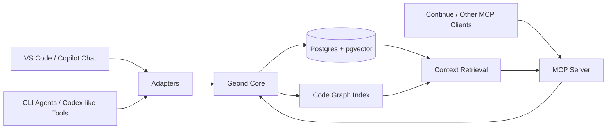

# geond-agent-protocol

A shared memory and code-graph protocol for coding agents.

`geond-agent-protocol` is an early-stage open source project for making coding agents share durable development context: chat history, code changes, symbol graphs, decisions, and handoff notes. The goal is not to replace Copilot, Codex, Continue, Cursor, or CLI agents. The goal is to give them a common memory layer they can read from and write to through MCP and lightweight adapters.

## Why

Coding agents are getting better, but their memory is fragmented.

- A VS Code chat may know why a function changed.
- A CLI agent may only see the current files.
- A test agent may not know the design intent behind a change.
- A future session may lose the debugging path that solved the same problem last week.

This project explores a durable local-first context layer where agents can share the same development memory without depending on one specific editor or model provider.

## Core Idea

The protocol stores development events in a local database, then exposes them through MCP tools and resources.

## Planned Capabilities

- Ingest chat sessions, code diffs, file snapshots, and agent actions.
- Parse source files with tree-sitter and store code entities and relationships.
- Retrieve context by semantic similarity, symbol neighborhood, timeline, and change intent.
- Expose shared memory through MCP tools such as `search_dev_memory`, `get_symbol_context`, and `record_agent_action`.
- Help agents coordinate by recording file reservations, active tasks, and handoff notes.
- Provide a local-first Docker setup using Postgres and pgvector.

## First Test Bed

The first research target is VS Code GitHub Copilot Chat storage. See [docs/vscode_chat_storage_structure.md](docs/vscode_chat_storage_structure.md) for the storage investigation and recovery notes.

## Documentation

- [docs/research_validation.md](docs/research_validation.md) validates the original idea, corrects assumptions, and compares alternatives.
- [docs/architecture.md](docs/architecture.md) describes the proposed system architecture and data model.
- [docs/implementation_plan.md](docs/implementation_plan.md) breaks the work into MVP phases and acceptance criteria.
- [docs/vscode_chat_storage_structure.md](docs/vscode_chat_storage_structure.md) documents the first VS Code Copilot Chat test bed.
- [docs/의식의 흐름 참고.md](docs/%EC%9D%98%EC%8B%9D%EC%9D%98%20%ED%9D%90%EB%A6%84%20%EC%B0%B8%EA%B3%A0.md) preserves the original ideation notes.

## Status

Design and planning stage. The repository currently contains research notes, architecture, and implementation plans. Code will be added incrementally, starting with a local Postgres schema and an MCP server skeleton.

## Design Principles

- Local-first by default.
- Explicit capture, not hidden surveillance.
- Agent-agnostic protocol surface.
- Durable memory with reversible provenance.
- Code-aware retrieval, not only text similarity.
- Privacy and redaction as first-class features.

## License

Apache-2.0. See [LICENSE](LICENSE).
