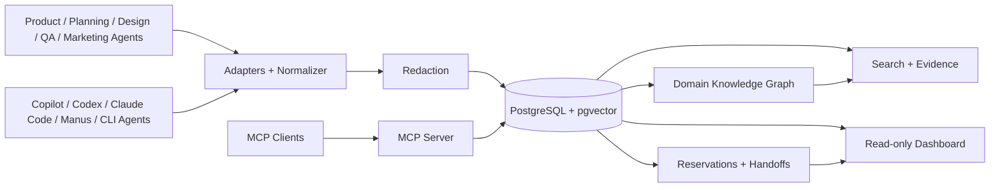
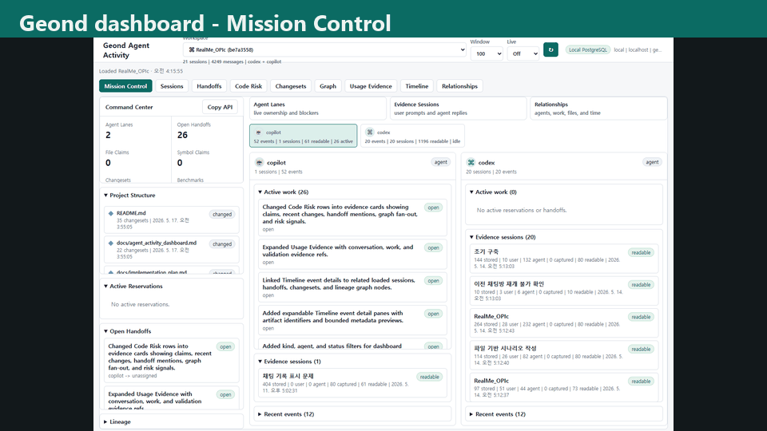
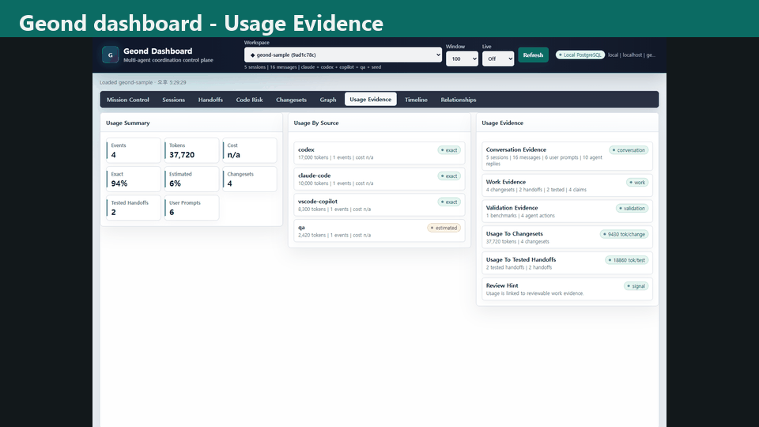
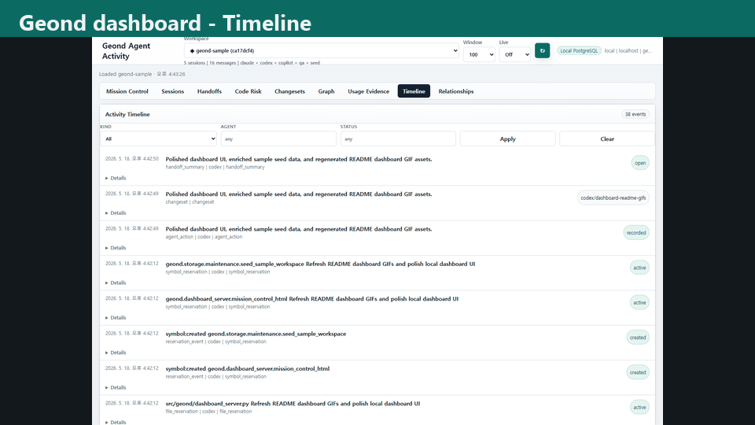

# Geond Agent Protocol

[](https://github.com/geondongkim/geond-agent-protocol/actions/workflows/ci.yml)
[](LICENSE)
[](pyproject.toml)

Geond is a local-first, cloud-capable shared context and coordination layer for
heterogeneous AI agents.

It gives agents a durable place to record what happened, why it happened, what
they claimed, what changed, how it was validated, and what the next agent should
do. The current implementation is strongest for repository-based work through
Copilot Chat, Codex, Claude Code, CLI, MCP, code graph, dashboard, reservation,
and handoff workflows. The protocol is intentionally broader: product, planning,
design, QA, marketing, support, operations, engineering, review, test, security,
documentation, deployment, and PM/orchestration agents can share the same
evidence model as new adapters are added.

> About the name: Geond is inspired by an Old English root of "beyond" and is
> pronounced `/dʒiːɒnd/` ("Jee-ond"). The project helps agents go beyond
> stateless prompts by connecting them to inspectable shared memory.

## Why Geond

AI agents are useful, but their context is fragmented.

- A product or planning agent may know why a feature exists.
- A design or QA agent may know the acceptance criteria and edge cases.
- A coding agent may touch the implementation.
- A review, security, documentation, deployment, or operations agent may need
  the same evidence without replaying every transcript.
- A PM or orchestration agent needs to know who is working, what is blocked, and
  what should be reviewed next.

Git records what changed. Geond records the operational context around the
change: sessions, messages, actions, reservations, handoffs, changesets, code
graph links, usage evidence, validation, and lineage.

## What It Does

| Capability | Current status |
| --- | --- |
| Shared memory | Stores sessions, messages, raw events, snapshots, changesets, actions, reservations, handoffs, aliases, redaction findings, usage events, and benchmark runs in PostgreSQL. |
| MCP server | Exposes search, evidence, symbol context, changesets, reservations, handoffs, dashboard read models, context review, and lineage through `uv run geond-mcp`. |
| CLI | Provides import, search, indexing, coordination, dashboard, usage, benchmark, install, and smoke-test commands through `uv run geond`. |
| Agent imports | Parses VS Code Copilot Chat workspace storage, Codex JSONL sessions, Claude Code JSONL sessions, and Manus API v2 task history with redaction before persistence. |
| Retrieval | Supports keyword, vector, hybrid, evidence refs, deterministic narratives, optional local/API reranking, and PostgreSQL full-text/trigram search. |
| Code graph | Indexes Python, TypeScript, and JavaScript with AST, tree-sitter, fallback scanners, import/call edges, LSP references, and diff hunk-to-symbol links. |
| Coordination | Supports file and symbol reservations, TTL renewal/release/expiry, audit events, advisory/strict/override policies, context review, and structured handoffs. |
| Dashboard | Serves a read-only local dashboard with workspace selector, DB source badge, agent lanes, sessions, timeline, lineage, reservations, handoffs, code risk, changesets, usage evidence, and trace readiness. |
| Team mode | Runs local MCP/CLI/dashboard processes against local PostgreSQL by default, or a shared Azure/remote PostgreSQL profile for multi-machine collaboration. |

Geond is alpha software. Enterprise IAM, row-level security, dedicated MCP audit
streams, non-development SaaS adapters, and dependency-expanded automatic
reservations are active roadmap areas rather than completed product promises.

## Architecture



The default setup is local-first: your editor, CLI, MCP server, dashboard, and
database-facing adapters run on your machine. For team validation, each person
can keep those processes local while pointing them at the same shared
PostgreSQL-compatible database. Azure Database for PostgreSQL Flexible Server
has been validated as one shared-memory backend; it is an embodiment, not a
hard dependency.







## Quick Start

Prerequisites: Python 3.11+, `uv`, Docker with Compose, Git, and ripgrep. See
[docs/developer_setup.md](docs/developer_setup.md) for OS-specific notes.

```bash
cp .env.example .env
uv sync
docker compose up -d postgres
docker compose --profile tools run --rm geond-migrate
uv run geond doctor --format text
uv run geond seed-sample
uv run geond mcp-smoke --format text --strict
```

Start the MCP server:

```bash
uv run geond-mcp
```

Serve the local dashboard:

```bash
uv run geond dashboard serve
```

Open the printed localhost URL. For MCP client setup, run:

```bash
uv run geond install --format text
uv run geond install --write
```

## Common Workflows

| Goal | Command or doc |
| --- | --- |
| Check environment | `uv run geond doctor --format text` |
| Import Copilot Chat | `uv run geond import-vscode <workspaceStorage-or-session-path>` |
| Import Codex | `uv run geond import-codex <codex-sessions-dir> --workspace-uri <uri>` |
| Import Claude Code | `uv run geond import-claude-code <claude-projects-dir> --workspace-uri <uri>` |
| Import Manus task | `uv run geond import-manus-task <task-id> --workspace-uri <uri>` |
| Search memory | `uv run geond search "why did this change" --mode hybrid` |
| Index code | `uv run geond index-tree-sitter <path>` |
| Record a changeset | `uv run geond record-changeset <workspace-id-or-uri> ...` |
| Reserve work | `uv run geond reserve-files ...` or `uv run geond reserve-symbols ...` |
| Review conflicts | `uv run geond review-context <workspace-id-or-uri> --format markdown` |
| Leave handoff | `uv run geond record-handoff <workspace-id-or-uri> ...` |
| Agent operating loop | [docs/agent_operating_loop.md](docs/agent_operating_loop.md) |
| MCP clients | [docs/mcp_client_config.md](docs/mcp_client_config.md) |

For a more complete demo path, see [docs/demo.md](docs/demo.md).

## Shared Team Database

Use `GEOND_DATABASE_URL` for the default local database. To keep local processes
but share memory across machines, add a second profile:

```bash
GEOND_DATABASE_PROFILE=azure
AZURE_GEOND_DATABASE_URL=postgresql://...
```

The dashboard classifies the active source as local PostgreSQL, Azure
PostgreSQL, or remote PostgreSQL without showing user info, passwords, or
tokens. The validated team flow is documented in
[docs/azure_validation/team_collab_validation.md](docs/azure_validation/team_collab_validation.md)
and summarized in [docs/azure_validation/README.md](docs/azure_validation/README.md).

## Documentation

- [docs/architecture.md](docs/architecture.md) explains the system layers and data model.
- [docs/agent_collaboration.md](docs/agent_collaboration.md) compares Geond with git-only review and simple shared notes.
- [docs/agent_activity_dashboard.md](docs/agent_activity_dashboard.md) describes the dashboard read model and PM/orchestration views.
- [docs/agent_operating_loop.md](docs/agent_operating_loop.md) defines the read, reserve, record, and handoff loop for agents.
- [docs/agent_testbeds.md](docs/agent_testbeds.md) tracks Copilot Chat, Codex, and Claude Code test beds.
- [docs/manus_integration.md](docs/manus_integration.md) documents Manus API v2 import, context packets, task contracts, and limitations.
- [docs/mcp_client_config.md](docs/mcp_client_config.md) shows VS Code, Claude Desktop, Continue, and other MCP client setup.
- [docs/ai_usage_observability.md](docs/ai_usage_observability.md) covers token, cost, pricing snapshot, and usage-versus-evidence design.
- [docs/benchmarking.md](docs/benchmarking.md) explains retrieval and evidence benchmark commands.
- [docs/open_source_readiness.md](docs/open_source_readiness.md) tracks launch risks, privacy, patent, dependency, and governance issues.
- [docs/marketing_strategy.md](docs/marketing_strategy.md) outlines Awesome MCP Servers, Manus, and community launch strategy.

## Contributing

Contributions are welcome while the project is alpha. Good first areas are
importers, docs, tests, dashboard read-model improvements, MCP contract tests,
installer ergonomics, and focused adapters for non-development work artifacts.

Read [CONTRIBUTING.md](CONTRIBUTING.md) before opening a PR. It covers setup,
privacy rules, test commands, redaction expectations, and files that must stay
out of git. Security reporting is in [SECURITY.md](SECURITY.md).

## Security And Privacy

Geond is designed for local-first use. Importers redact common secrets before
persistence, external embeddings are opt-in, and the dashboard avoids exposing
credential-bearing connection strings. Even so, agent transcripts can contain
sensitive information. Review `.env`, transcripts, screenshots, benchmark logs,
and dashboard captures before sharing them.

Do not commit private transcripts, local evidence exports, `docs/patent`,
`repo`, `tmp`, `result`, `results`, or generated videos. See
[SECURITY.md](SECURITY.md) and [docs/open_source_readiness.md](docs/open_source_readiness.md).

## License

Apache-2.0. See [LICENSE](LICENSE).
