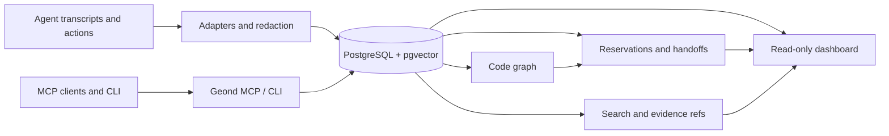

> Language: **English** | [한국어](README.ko.md) | [日本語](README.ja.md) | [简体中文](README.zh-CN.md) | [Español](README.es.md) | [Français](README.fr.md) | [Deutsch](README.de.md)

# Geond Agent Protocol

[](https://github.com/geondongkim/geond-agent-protocol/actions/workflows/ci.yml)
[](LICENSE)
[](pyproject.toml)

Shared memory and coordination for AI agents that work on the same repo.

Geond gives Copilot Chat, Codex, Claude Code, Antigravity, Manus, CLI agents,
and MCP-capable tools a durable place to share what happened, why it happened,
what changed, what is reserved, how it was validated, and what the next agent or
reviewer should do.


Geond is local-first by default. Your editor, CLI, MCP server, dashboard, and
importers can run on your machine against local PostgreSQL. When a team wants
multi-machine collaboration, those same local processes can point at a shared
PostgreSQL-compatible profile such as Azure Database for PostgreSQL.

Geond is alpha software. Repository-centered memory, MCP, CLI, dashboard read
models, reservations, handoffs, code graph indexing, usage evidence, benchmarks,
and shared PostgreSQL validation are implemented today. Enterprise IAM,
row-level security, dedicated MCP audit streams, broad SaaS adapters, and
dependency-expanded automatic reservations are roadmap areas.

> About the name: Geond is inspired by an Old English root of "beyond" and is
> pronounced "Jee-ond". The project helps agents go beyond stateless prompts by
> connecting them to inspectable shared memory.

## Quick Start

Prerequisites: Python 3.11+, `uv`, Docker with Compose, Git, and ripgrep. See
[docs/developer_setup.md](docs/developer_setup.md) for OS-specific notes.

```bash
cp .env.example .env
uv sync
docker compose up -d postgres
docker compose --profile tools run --rm geond-migrate
uv run geond doctor --format text
uv run geond seed-sample
uv run geond mcp-smoke --format text --strict
```

Start the MCP server:

```bash
uv run geond-mcp
```

Preview or write MCP client config:

```bash
uv run geond install --format text
uv run geond install --write
```

Serve the read-only dashboard:

```bash
uv run geond dashboard serve
```

Open the printed localhost URL. More MCP client examples are in
[docs/mcp_client_config.md](docs/mcp_client_config.md).

## What Geond Makes Possible

| Scenario | What you can do | Proof and entrypoint |
| --- | --- | --- |
| AI pair coding across agent tools | Let different agents work on the same repo through shared memory, reservations, handoffs, and review context. Verified locally with Codex and Antigravity; the same pattern applies to Copilot, Claude Code, Continue, Manus, or custom MCP agents. | [docs/antigravity_codex_geond_verification.md](docs/antigravity_codex_geond_verification.md), [docs/mcp_client_config.md](docs/mcp_client_config.md) |
| Multi-PC collaboration | Run `geond-mcp`, CLI, and dashboard locally on each machine while Windows, MacBook, CI, or another teammate all read and write the same shared PostgreSQL profile. | [docs/azure_validation/team_collab_validation.md](docs/azure_validation/team_collab_validation.md), [docs/azure_validation/README.md](docs/azure_validation/README.md) |
| PM and reviewer dashboard | Review agent lanes, sessions, handoffs, changesets, code risk, usage evidence, timeline, and lineage without reading raw MCP JSON. | `uv run geond dashboard serve`, [docs/agent_activity_dashboard.md](docs/agent_activity_dashboard.md) |
| Safe parallel editing | Ask agents to review current context, reserve files or symbols, record changesets, and leave structured handoffs before another agent edits the same target. | [docs/agent_operating_loop.md](docs/agent_operating_loop.md), `uv run geond review-context ...` |
| Cross-agent memory import | Import Copilot Chat, Codex, Claude Code, Antigravity, and Manus task evidence into one redacted search and evidence model. | [docs/agent_testbeds.md](docs/agent_testbeds.md), [docs/manus_integration.md](docs/manus_integration.md) |
| Compact MCP context | Return snippets, evidence refs, scores, and follow-up detail paths instead of flooding an LLM with raw transcripts by default. | [tests/test_mcp_payload_budget.py](tests/test_mcp_payload_budget.py), [docs/ai_usage_observability.md](docs/ai_usage_observability.md) |

## Demo GIFs

These GIFs are generated from sanitized scenario text, not private transcripts.
Regenerate them with `uv run python scripts/render_readme_gifs.py`.


For browser-verified dashboard captures and longer terminal demo notes, see
[docs/public_demo_script.md](docs/public_demo_script.md).

## Learning Path

Start with [learn/README.md](learn/README.md) for guided notebooks that mirror
the README scenarios:

| Lesson | Focus |
| --- | --- |
| [01 Local Shared Memory](learn/01_local_shared_memory.ipynb) | Run local PostgreSQL, seed sample evidence, search memory, and smoke-test MCP. |
| [02 Handoffs And Reservations](learn/02_handoffs_and_reservations.ipynb) | Practice context review, symbol reservations, conflicts, and handoff packets. |
| [03 AI Pair Coding Workflow](learn/03_ai_pair_coding_workflow.ipynb) | Share evidence between Agent A and Agent B across different agent tools. |
| [04 Shared PostgreSQL Team Mode](learn/04_shared_postgres_team_mode.ipynb) | Understand optional shared PostgreSQL profiles for multi-PC collaboration. |

## How It Works



1. Memory: importers normalize sessions, events, messages, usage records, and
   task history from agent tools, then redact common secrets before persistence.
1. Code graph: Python, TypeScript, and JavaScript indexers connect files,
   symbols, imports, calls, references, and changesets.
1. Reservations: agents can claim files or symbols with TTLs, policy checks,
   renewals, releases, and auditable reservation events.
1. Handoffs: agents leave structured next-action packets with tested commands,
   blockers, remaining risks, and evidence refs.
1. Dashboard: humans and PM/orchestrator agents read compact overview, activity,
   timeline, code risk, usage, lineage, reservations, and handoff read models.
1. Shared PostgreSQL: local-first setups use Docker PostgreSQL; team profiles can
   point local processes at Azure or another PostgreSQL-compatible backend.

## Common Workflows

| Goal | Command or doc |
| --- | --- |
| Check environment | `uv run geond doctor --format text` |
| Import Copilot Chat | `uv run geond import-vscode <workspaceStorage-or-session-path>` |
| Import Codex | `uv run geond import-codex <codex-sessions-dir> --workspace-uri <uri>` |
| Import Claude Code | `uv run geond import-claude-code <claude-projects-dir> --workspace-uri <uri>` |
| Import Antigravity | `uv run geond import-antigravity <storage-path> --workspace-uri <uri>` |
| Import Manus task | `uv run geond import-manus-task <task-id> --workspace-uri <uri>` |
| Search memory | `uv run geond search "why did this change" --mode hybrid` |
| Index code | `uv run geond index-tree-sitter <path>` |
| Record a changeset | `uv run geond record-changeset <workspace-id-or-uri> ...` |
| Reserve work | `uv run geond reserve-files ...` or `uv run geond reserve-symbols ...` |
| Review conflicts | `uv run geond review-context <workspace-id-or-uri> --format markdown` |
| Leave handoff | `uv run geond record-handoff <workspace-id-or-uri> ...` |
| Agent operating loop | [docs/agent_operating_loop.md](docs/agent_operating_loop.md) |
| MCP clients | [docs/mcp_client_config.md](docs/mcp_client_config.md) |

For a more complete demo path, see [docs/demo.md](docs/demo.md).

## Shared Team Database

Use `GEOND_DATABASE_URL` for the default local database. To keep local processes
but share memory across machines, add a second profile:

```bash
GEOND_DATABASE_PROFILE=azure
AZURE_GEOND_DATABASE_URL=postgresql://...
```

The dashboard classifies the active source as local PostgreSQL, Azure
PostgreSQL, or remote PostgreSQL without showing user info, passwords, or
tokens. The validated team flow is documented in
[docs/azure_validation/team_collab_validation.md](docs/azure_validation/team_collab_validation.md).

## README Patterns Borrowed

Geond's README borrows a few public onboarding patterns and adapts them to this
project rather than copying their product scope:

- [OpenHuman](https://github.com/tinyhumansai/openhuman): explain transparent,
  local-first memory and compact context clearly.
- [CLI-Anything](https://github.com/HKUDS/CLI-Anything): make the first screen
  visual and action-oriented with short commands and GIFs.
- [Microsoft AI Agents for Beginners](https://github.com/microsoft/ai-agents-for-beginners):
  present agent concepts as scenario tables and repeatable learning paths.

## Documentation

- [docs/architecture.md](docs/architecture.md) explains the system layers and data model.
- [docs/agent_activity_dashboard.md](docs/agent_activity_dashboard.md) describes dashboard read models and PM/orchestrator views.
- [docs/agent_operating_loop.md](docs/agent_operating_loop.md) defines the read, reserve, record, and handoff loop for agents.
- [docs/agent_testbeds.md](docs/agent_testbeds.md) tracks Copilot Chat, Codex, Claude Code, and Antigravity test beds.
- [docs/manus_integration.md](docs/manus_integration.md) documents Manus API v2 import, context packets, task contracts, and limitations.
- [docs/mcp_client_config.md](docs/mcp_client_config.md) shows VS Code, Claude Desktop, Continue, Antigravity, and other MCP client setup.
- [docs/ai_usage_observability.md](docs/ai_usage_observability.md) covers token, cost, pricing snapshot, and usage-versus-evidence design.
- [docs/benchmarking.md](docs/benchmarking.md) explains retrieval, evidence, and agent-run benchmark commands.
- [docs/open_source_readiness.md](docs/open_source_readiness.md) tracks launch risks, privacy, dependency, and governance issues.
- [learn/README.md](learn/README.md) provides a notebook-based onboarding path.

## Contributing

Contributions are welcome while the project is alpha. Good first areas are
importers, docs, tests, dashboard read-model improvements, MCP contract tests,
installer ergonomics, and focused adapters for non-development work artifacts.

Read [CONTRIBUTING.md](CONTRIBUTING.md) before opening a PR. It covers setup,
privacy rules, test commands, redaction expectations, and files that must stay
out of git. Security reporting is in [SECURITY.md](SECURITY.md).

## Security And Privacy

Geond is designed for local-first use. Importers redact common secrets before
persistence, external embeddings are opt-in, and the dashboard avoids exposing
credential-bearing connection strings. Even so, agent transcripts can contain
sensitive information. Review `.env`, transcripts, screenshots, benchmark logs,
and dashboard captures before sharing them.

Do not commit private transcripts, local evidence exports, local-only drafts,
`repo`, `tmp`, `result`, `results`, or generated videos. See
[SECURITY.md](SECURITY.md) and [docs/open_source_readiness.md](docs/open_source_readiness.md).

## License

Apache-2.0. See [LICENSE](LICENSE).
