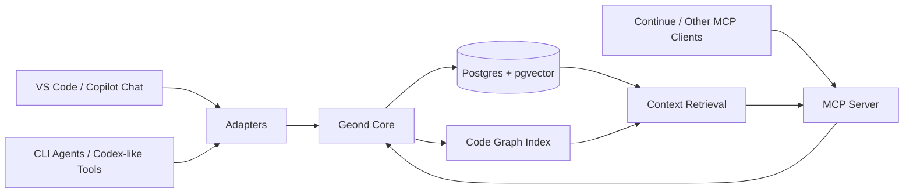

# geond-agent-protocol

A shared memory and code-graph protocol for coding agents.

`geond-agent-protocol` is an early-stage open source project for making coding agents share durable development context: chat history, code changes, symbol graphs, decisions, and handoff notes. The goal is not to replace Copilot, Codex, Continue, Cursor, or CLI agents. The goal is to give them a common memory layer they can read from and write to through MCP and lightweight adapters.

## Why

Coding agents are getting better, but their memory is fragmented.

- A VS Code chat may know why a function changed.
- A CLI agent may only see the current files.
- A test agent may not know the design intent behind a change.
- A future session may lose the debugging path that solved the same problem last week.

This project explores a durable local-first context layer where agents can share the same development memory without depending on one specific editor or model provider.

## Core Idea

The protocol stores development events in a local database, then exposes them through MCP tools and resources.



## Planned Capabilities

- Ingest chat sessions, code diffs, file snapshots, and agent actions.
- Parse source files with tree-sitter and store code entities and relationships.
- Retrieve context by semantic similarity, symbol neighborhood, timeline, and change intent.
- Expose shared memory through MCP tools such as `search_dev_memory`, `get_symbol_context`, and `record_agent_action`.
- Help agents coordinate by recording file reservations, active tasks, and handoff notes.
- Provide a local-first Docker setup using Postgres and pgvector.

## Test Beds

The first research target is VS Code GitHub Copilot Chat storage. See [docs/vscode_chat_storage_structure.md](docs/vscode_chat_storage_structure.md) for the storage investigation and recovery notes.

Codex is now the second test bed. See [docs/codex_testbed.md](docs/codex_testbed.md) for the local JSONL session parser and validation path.

## Documentation

- [docs/research_validation.md](docs/research_validation.md) validates the original idea, corrects assumptions, and compares alternatives.
- [docs/architecture.md](docs/architecture.md) describes the proposed system architecture and data model.
- [docs/implementation_plan.md](docs/implementation_plan.md) breaks the work into MVP phases and acceptance criteria.
- [docs/embedding_configuration.md](docs/embedding_configuration.md) explains embedding provider choices and what secrets/configuration are needed.
- [docs/model_provider_strategy.md](docs/model_provider_strategy.md) records the OpenAI MVP choices and future provider comparison plan.
- [docs/vscode_chat_storage_structure.md](docs/vscode_chat_storage_structure.md) documents the first VS Code Copilot Chat test bed.
- [docs/codex_testbed.md](docs/codex_testbed.md) documents the Codex JSONL test bed.
- [docs/의식의 흐름 참고.md](docs/%EC%9D%98%EC%8B%9D%EC%9D%98%20%ED%9D%90%EB%A6%84%20%EC%B0%B8%EA%B3%A0.md) preserves the original ideation notes.

## Quick Start

Create local configuration:

```bash
cp .env.example .env
```

Set `GEOND_EMBEDDING_API_KEY` in `.env`. For the MVP, Geond uses OpenAI `text-embedding-3-small` with 1536-dimensional vectors.

Install dependencies with uv:

```bash
uv sync
```

Start Postgres with pgvector:

```bash
docker compose up -d postgres
```

On Windows, make sure Docker Desktop is running before this step.

Apply the initial schema:

```bash
docker compose --profile tools run --rm geond-migrate
```

Parse a VS Code Copilot Chat workspaceStorage folder without writing to the database:

```bash
uv run geond parse-vscode "C:/path/to/workspaceStorage/<hash>"
```

Import a workspaceStorage folder into Geond:

```bash
uv run geond import-vscode "C:/path/to/workspaceStorage/<hash>" \
    --workspace-uri "file:///C:/path/to/project" \
    --workspace-name "my-project"
```

Parse a Codex session or Codex sessions directory without writing to the database:

```bash
uv run geond parse-codex "C:/Users/<you>/.codex/sessions" --limit 5
```

Import Codex sessions into Geond:

```bash
uv run geond import-codex "C:/Users/<you>/.codex/sessions" \
    --limit 5 \
    --workspace-uri "file:///C:/path/to/project" \
    --workspace-name "my-project"
```

Codex and VS Code imports pass raw event payloads and message content through a conservative redaction baseline before persistence. It masks sensitive keys, environment secret assignments, bearer tokens, GitHub-style tokens, OpenAI-style keys, and URL passwords while recording non-secret redaction metadata in `redaction_findings`.

Repeat imports update existing sessions and remove stale message rows when local session files change. Retrieval snippets are generated in Python so multilingual text is sliced on character boundaries rather than database byte boundaries.

Create embeddings for imported messages:

```bash
uv run geond embed-messages --limit 100
```

Compare keyword, vector, and hybrid retrieval:

```bash
uv run geond search "왜 이 파일이 바뀌었어?" --mode keyword
uv run geond search "왜 이 파일이 바뀌었어?" --mode vector
uv run geond search "왜 이 파일이 바뀌었어?" --mode hybrid
```

Limit retrieval to one workspace or source:

```bash
uv run geond search "추가 테스트베드" \
    --mode keyword \
    --workspace-uri "file:///C:/path/to/project" \
    --source codex
```

Run the MCP server:

```bash
uv run geond-mcp
```

## Status

Early MVP stage. The repository contains research notes, architecture, implementation plans, a local Postgres/pgvector schema, VS Code Copilot Chat and Codex read-only importers, OpenAI embedding support, keyword/vector/hybrid retrieval, and an MCP server skeleton.

## Design Principles

- Local-first by default.
- Explicit capture, not hidden surveillance.
- Agent-agnostic protocol surface.
- Durable memory with reversible provenance.
- Code-aware retrieval, not only text similarity.
- Privacy and redaction as first-class features.

## License

Apache-2.0. See [LICENSE](LICENSE).
