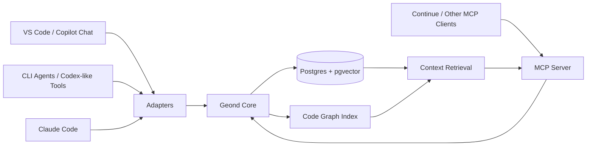

# geond-agent-protocol

Local-first development memory, evidence, code graphs, and coordination for
coding agents.

> **About the name:** Geond is inspired by the Old English root of "beyond". We pronounce it modernly as `/dʒiːɒnd/` ("Jee-ond"). The project helps coding agents go geond their stateless prompt limits by connecting LLMs to local, inspectable development memory, code graphs, and handoff context.

`geond-agent-protocol` is an alpha MCP/CLI package for making coding agents
share durable development context: chat history, code changes, symbol graphs,
decisions, reservations, benchmarks, and handoff notes. The goal is not to
replace Copilot, Codex, Continue, Cursor, Claude Code, or CLI agents. The goal
is to give them a common local memory layer they can read from and write to
through MCP and lightweight adapters.

Geond is local-first, not local-only. The default workflow runs the MCP server,
CLI, dashboard, and database-facing adapters on each developer machine. Teams
can intentionally point those local processes at a shared PostgreSQL-compatible
database, such as Azure Database for PostgreSQL Flexible Server, and route model
calls through an embedding gateway when they need cloud-backed collaboration.

## Why

Coding agents are getting better, but their memory is fragmented.

- A VS Code chat may know why a function changed.
- A CLI agent may only see the current files.
- A test agent may not know the design intent behind a change.
- A future session may lose the debugging path that solved the same problem last week.

Geond gives those agents a durable, inspectable context layer without depending
on one editor, one model provider, or one chat transcript format.

## Core Idea

The protocol stores development events in a local database, then exposes them through MCP tools and resources.



## What Works Today

- Import and redact VS Code Copilot Chat, Codex JSONL, and Claude Code sessions.
- Store sessions, messages, raw events, file snapshots, changesets, redaction findings, agent actions, reservations, handoffs, benchmark runs, and workspace aliases in Postgres + pgvector.
- Search memory with keyword, vector, hybrid, and optional local or HTTP reranking.
- Return canonical `geond.evidence.v1` refs and deterministic narratives for retrieved messages, changesets, symbols, files, and call-impact edges.
- Index Python, TypeScript, and JavaScript with AST, tree-sitter, and conservative fallback parsers.
- Resolve same-file calls, cross-file imports, TypeScript/JavaScript default imports, re-export barrels, and editor-provided LSP reference edges.
- Link unified diff hunks to touched symbols, including deletion-only hunks.
- Coordinate agent work with file/symbol reservations, renewals, release, conflict policies, audit events, structured handoffs, context review, and workspace lineage graphs.
- Generate benchmark reports, public demo GIFs, package artifacts, checksums, GitHub Releases, Sigstore bundles, and manual PyPI trusted publishing workflows.
- Preview or write common MCP/editor configuration with `geond install`, and verify real MCP stdio behavior with `geond mcp-smoke`.

## Planned Next

- Expand the read-only localhost dashboard with richer code-risk and handoff-board views on top of the current mission-control, agent-lane, session, usage, and timeline views.
- Add normalized activity events so agent lifecycle hooks, CLI workflows, trace adapters, and future orchestrators can read one ordered stream.
- Continue improving adoption paths with editor commands, TestPyPI/release observation, and smaller local setup options.

## Command Map

| Goal | Command or surface |
| --- | --- |
| Check setup | `uv run geond doctor --format text` |
| Install editor/MCP config | `uv run geond install --write` |
| Smoke-test the MCP server | `uv run geond mcp-smoke --format text --strict` |
| Import agent memory | `import-vscode` / `import-codex` / `import-claude-code` (sessions plus usage) |
| Index source code | `index-tree-sitter`, `index-python`, `index-ts-js` |
| Import editor references | `collect-lsp-references`, `import-lsp-references` |
| Search memory | `search --mode keyword`, `search --mode vector`, or `search --mode hybrid` |
| Explain code changes | `record-changeset`, `explain-change`, `summarize-changeset` |
| Coordinate agents | `start-task`, `finish-task`, `record-agent-action`, `reserve-files`, `reserve-symbols`, `record-handoff`, `review-context` |
| Inspect agent activity | `dashboard-overview`, `dashboard-events` |
| Inspect AI usage | `usage-summary`, `usage-by-agent`, `usage-by-model`, `usage-risk-signals`, dashboard Usage Evidence tab and `/api/workspaces/{id}/usage` |
| Serve dashboard API | `uv run geond dashboard serve` |
| Measure retrieval quality | `benchmark-search`, `benchmark-report` |
| Serve MCP | `uv run geond-mcp` |

## Test Beds

The current test beds are VS Code GitHub Copilot Chat, Codex, and Claude Code.
See [docs/agent_testbeds.md](docs/agent_testbeds.md) for the comparison,
validation status, and improvement plan.

## Documentation

- [docs/research_validation.md](docs/research_validation.md) validates the original idea, corrects assumptions, and compares alternatives.
- [docs/architecture.md](docs/architecture.md) describes the proposed system architecture and data model.
- [docs/implementation_plan.md](docs/implementation_plan.md) breaks the work into MVP phases and acceptance criteria.
- [docs/embedding_configuration.md](docs/embedding_configuration.md) explains embedding provider choices and what secrets/configuration are needed.
- [docs/model_provider_strategy.md](docs/model_provider_strategy.md) compares OpenAI, Azure OpenAI, and local SLM embedding options.
- [docs/provider_extensions.md](docs/provider_extensions.md) covers OpenAI, Azure OpenAI, gateway, and local embedding modes.
- [docs/deployment_guide.md](docs/deployment_guide.md) explains Azure CLI and Azure Portal deployment flows with AWS/GCP resource analogues.
- [docs/azure_validation/team_collab_validation.md](docs/azure_validation/team_collab_validation.md) defines the shared Azure PostgreSQL validation for Windows and Apple Silicon clients.
- [docs/developer_setup.md](docs/developer_setup.md) lists prerequisites, OS-specific install notes, and verification commands.
- [docs/mcp_client_config.md](docs/mcp_client_config.md) provides Claude Desktop, Continue, and VS Code MCP client examples.
- [docs/workspace_identity_and_search.md](docs/workspace_identity_and_search.md) explains folder move tracking, workspace aliases, multilingual search, and when Elasticsearch/CDC may be worth it.
- [docs/benchmarking.md](docs/benchmarking.md) shows the current retrieval benchmark command.
- [docs/ci.md](docs/ci.md) records CI environment rules and the local validation checklist.
- [docs/azure_validation/README.md](docs/azure_validation/README.md) records the temporary Azure OpenAI, APIM, and VM validation workflow and sanitized evidence.
- [docs/improvement_backlog.md](docs/improvement_backlog.md) lists prioritized next improvements for evidence quality, deployment, retrieval, and adoption.
- [docs/agent_testbeds.md](docs/agent_testbeds.md) compares the Copilot Chat, Codex, and Claude Code test beds.
- [docs/agent_activity_dashboard.md](docs/agent_activity_dashboard.md) proposes the local dashboard, live activity model, and PM/orchestration use cases.
- [docs/geond_mcp_repository_evaluation.md](docs/geond_mcp_repository_evaluation.md) evaluates Geond against an MCP repository selection rubric, including lightweight MCP tradeoffs and enterprise gaps.
- [docs/agent_operating_loop.md](docs/agent_operating_loop.md) defines the recommended read, reserve, record, and handoff loop for Codex, Claude Code, Copilot, and other agents.
- [docs/ai_usage_observability.md](docs/ai_usage_observability.md) designs token, prompt, cost, pricing snapshots, and usage-versus-evidence observability without encouraging tokenmaxxing.
- [docs/geond_roadmap_backlog.md](docs/geond_roadmap_backlog.md) turns the evaluation into prioritized implementation phases and backlog items.
- [docs/agent_doc_consumption_guide.md](docs/agent_doc_consumption_guide.md) tells future agents which docs to read for each task type.
- [docs/vscode_chat_storage_structure.md](docs/vscode_chat_storage_structure.md) documents the first VS Code Copilot Chat test bed.
- [docs/codex_testbed.md](docs/codex_testbed.md) documents the Codex JSONL test bed.
- [docs/demo.md](docs/demo.md) walks through the current seed, retrieval, code graph, MCP, coordination, and purge demo.
- [docs/apple_silicon.md](docs/apple_silicon.md) covers native arm64 setup notes for MacBook development.
- [docs/public_demo_script.md](docs/public_demo_script.md) provides a ready-to-record public demo/GIF script.

## Quick Start

Prerequisites: Python 3.11+, uv, Docker with Compose, Git, and ripgrep. Install
PostgreSQL client tools too when you need `pg_dump`/`psql` export/import against
a shared database. See
[docs/developer_setup.md](docs/developer_setup.md) for Windows, macOS, Linux,
and Apple Silicon install and verification commands.

Create local configuration:

```bash
cp .env.example .env
```

`GEOND_DATABASE_URL` remains the default active database. For shared validation,
put the Azure connection string in `AZURE_GEOND_DATABASE_URL` and set
`GEOND_DATABASE_PROFILE=azure`; Geond also accepts profile-specific names such as
`GEOND_DATABASE_URL_TEAM_BLUE` for additional shared databases.

For keyword-only local demos, no external embedding key is required. Set
`GEOND_EMBEDDING_API_KEY` or provider-specific Azure/OpenAI-compatible values
only when you want `embed-messages`, vector search, or hybrid search with real
embeddings. The default OpenAI model is `text-embedding-3-small` with
1536-dimensional vectors.

Install dependencies with uv:

```bash
uv sync
```

Enable local pre-commit hooks:

```bash
uv run pre-commit install
uv run pre-commit run --all-files
```

GitHub Actions runs the same pre-commit, compile, pytest, and package build
checks on pushes and pull requests using a `pgvector/pgvector:pg16` Postgres
service. CI disables external embedding calls with `GEOND_EMBEDDING_PROVIDER=none`
but leaves privacy-mode behavior to the tests; see [docs/ci.md](docs/ci.md).

Start Postgres with pgvector:

```bash
docker compose up -d postgres
```

On Windows, make sure Docker Desktop is running before this step. On Apple
Silicon Macs, use native arm64 tooling and avoid forcing `linux/amd64`; see
[docs/apple_silicon.md](docs/apple_silicon.md).

Apply all schema migrations:

```bash
docker compose --profile tools run --rm geond-migrate
```

For direct local runs, use `uv run geond migrate --all`. The older
`uv run geond migrate --schema schemas/001_initial.sql` path remains available
for explicitly reapplying one idempotent schema file during development.

Insert a small sample workspace and session:

```bash
uv run geond seed-sample
```

Preview workspace MCP and VS Code LSP task configuration:

```bash
uv run geond install --format text
```

Write the default workspace files, `.vscode/mcp.json` and `.vscode/tasks.json`:

```bash
uv run geond install --write
```

Check the local setup, including `.env`, Postgres, pgvector, Docker, and MCP
registration:

```bash
uv run geond doctor --format text
```

Run a real MCP stdio smoke check after seeding sample data. This starts
`geond-mcp`, initializes it through the MCP client SDK, lists tools/resources,
reads `geond://sessions`, and calls `search_dev_memory`:

```bash
uv run geond mcp-smoke --format text --strict
```

For transport-only checks against a fresh database or a custom query that may
not return seeded messages, add `--allow-empty-search`.

Parse a VS Code Copilot Chat workspaceStorage folder without writing to the database:

```bash
uv run geond parse-vscode "C:/path/to/workspaceStorage/<hash>"
```

Import a workspaceStorage folder into Geond:

```bash
uv run geond import-vscode "C:/path/to/workspaceStorage/<hash>" \
    --workspace-uri "file:///C:/path/to/project" \
    --workspace-name "my-project"
```

Parse a Codex session or Codex sessions directory without writing to the database:

```bash
uv run geond parse-codex "C:/Users/<you>/.codex/sessions" --limit 5
```

Import Codex sessions into Geond:

```bash
uv run geond import-codex "C:/Users/<you>/.codex/sessions" \
    --limit 5 \
    --workspace-uri "file:///C:/path/to/project" \
    --workspace-name "my-project"
```

Parse Claude Code sessions without writing to the database:

```bash
uv run geond parse-claude-code "C:/Users/<you>/.claude/projects" --limit 5
```

Import Claude Code sessions into Geond. If `--workspace-uri` and
`--workspace-name` are omitted, Geond derives them from Claude Code's JSONL
`cwd` metadata:

```bash
uv run geond import-claude-code "C:/Users/<you>/.claude/projects" --limit 5
```

Copilot Chat, Codex, and Claude Code imports pass raw event payloads and message content through a conservative redaction baseline before persistence. It masks sensitive keys, environment secret assignments, bearer tokens, GitHub-style tokens, OpenAI-style keys, and URL passwords while recording non-secret redaction metadata in `redaction_findings`.

Repeat imports update existing sessions and remove stale message rows when local session files change. Retrieval snippets are generated in Python so multilingual text is sliced on character boundaries rather than database byte boundaries.

Create embeddings for imported messages:

```bash
uv run geond embed-messages --limit 100
```

Compare keyword, vector, and hybrid retrieval:

```bash
uv run geond search "왜 이 파일이 바뀌었어?" --mode keyword
uv run geond search "왜 이 파일이 바뀌었어?" --mode vector
uv run geond search "왜 이 파일이 바뀌었어?" --mode hybrid
```

Optionally rerank the top candidate pool with a deterministic local lexical
reranker, or with a pluggable HTTP API reranker configured through
`GEOND_RERANK_URL`, after keyword, vector, or hybrid retrieval:

```bash
uv run geond search "왜 service.py 파일이 바뀌었어?" \
    --mode hybrid \
    --rerank local \
    --candidate-limit 30

GEOND_RERANK_URL=http://localhost:8000/rerank \
uv run geond search "왜 service.py 파일이 바뀌었어?" \
    --mode hybrid \
    --rerank api \
    --candidate-limit 30
```

API rerankers receive `{query, candidates}` and may return `scores`, `results`,
or `rankings` entries keyed by `id`, `message_id`, or `candidate_id`.
`GEOND_PRIVACY_MODE=local-only` only allows local reranker URLs.

Limit retrieval to one workspace or source:

```bash
uv run geond search "추가 테스트베드" \
    --mode keyword \
    --workspace-uri "file:///C:/path/to/project" \
    --source codex
```

If a project folder is renamed or moved, register the new URI as an alias so
future imports and searches continue to resolve to the original workspace:

```bash
uv run geond register-workspace-alias \
    "file:///C:/old/path/project" \
    "file:///C:/new/path/project" \
    --reason folder-move
```

Workspace-scoped search resolves both root URIs and registered aliases. Keyword
search uses Postgres full-text GIN plus `pg_trgm` substring matching, while
hybrid search adds pgvector semantic candidates when embeddings are configured.

For moved git repositories, record durable fingerprints on the original
workspace and ask Geond to suggest the alias for a new checkout path:

```bash
uv run geond fingerprint-workspace \
    "file:///C:/old/path/project" \
    "C:/old/path/project"

uv run geond suggest-workspace-aliases \
    "C:/new/path/project" \
    --register-best
```

The git remote fingerprint is sanitized before storage so URL credentials are
not persisted. Fingerprint discovery also records root manifest file hashes
(`pyproject.toml`, `package.json`, lockfiles, and similar) plus hashed package
names where available, which helps alias suggestions survive remote URL changes
or non-git project copies without storing raw package names.

Index Python code into the local code graph:

```bash
uv run geond index-python "C:/path/to/project" \
    --workspace-uri "file:///C:/path/to/project" \
    --workspace-name "my-project"
```

Index TypeScript or JavaScript code into the local code graph:

```bash
uv run geond index-ts-js "C:/path/to/project" \
    --workspace-uri "file:///C:/path/to/project" \
    --workspace-name "my-project"
```

Index Python, TypeScript, and JavaScript with the tree-sitter-backed path:

```bash
uv run geond index-tree-sitter "C:/path/to/project" \
    --workspace-uri "file:///C:/path/to/project" \
    --workspace-name "my-project"
```

Use the MCP tool `get_symbol_context` or the Python API to retrieve functions, classes, methods, modules, imports, related changesets, and caller/callee relationships stored in the code graph.
Python and TypeScript/JavaScript indexing record same-file calls and
import-qualified cross-file calls as `calls` edges when the target symbol is
indexed in the same workspace. TypeScript/JavaScript default imports also
resolve to named default-export functions/classes when Geond can identify them,
and re-export barrel modules are followed for named, default-as, and unambiguous
wildcard exports.
Editor or client integrations can also import LSP reference results into the
same code graph without requiring Geond to host a language server:

```bash
uv run geond import-lsp-references <workspace-id> references.json
```

The JSON input can be a list or `{ "references": [...] }`. Each reference may
identify a `target_qualified_name` and either a `source_qualified_name` or a
`reference.file_path` plus `reference.start_line`; imported edges are stored as
`references` with `metadata.source="lsp"` and surface in `get_symbol_context`.
The same command also accepts VS Code/LSP `Location[]`-style payloads with
`uri` and `range` fields. Pass `--target-qualified-name`, `--workspace-root`,
and `--provider` when those values are not embedded in the payload; see
`examples/lsp_references/vscode_locations.json` for the fixture shape.
Use `normalize-lsp-references` to inspect or write the converted Geond reference
JSON before importing:

```bash
uv run geond normalize-lsp-references examples/lsp_references/vscode_locations.json
```

Geond can also call a stdio language server directly and write the live
`Location[]` payload before importing it. Lines are 1-based and characters are
0-based:

```bash
uv run geond collect-lsp-references examples/python_service/service.py \
    --line 4 \
    --character 5 \
    --workspace-root examples/python_service \
    --target-qualified-name service.build_answer \
    --server-profile auto \
    --output references.json

uv run geond import-lsp-references <workspace-id> references.json
```

Add `--import-workspace-id <workspace-id-or-uri>` to collect and import in one
step. The command works with any stdio language server that implements
`textDocument/references`, so CI can use the built-in `pyright` and `typescript`
profiles, or another language-specific server through `--server-command`,
without Geond hosting a language server. Run `uv run geond lsp-server-profiles`
to list the built-in profile commands and install hints.

Record a changeset and link it to indexed code entities:

```bash
uv run geond record-changeset \
    --workspace-uri "file:///C:/path/to/project" \
    --workspace-name "my-project" \
    --file "src/service.py" \
    --patch-file "tmp/service.diff" \
    --intent "explain recent service change" \
    --summary "Updated service behavior after agent review."
```

When a unified diff patch is provided, Geond links the changeset to symbols whose
`start_line`/`end_line` overlap the changed hunk range. Deletion-only hunks keep
old-file deleted line metadata and anchor to the new-file line position where the
deletion occurred. Without a patch, Geond falls back to file-path links.

Retrieval outputs include canonical `geond.evidence.v1` evidence references with
stable `target_id`, `locator`, and `metadata` fields. Existing alias fields such
as `message_id`, `changeset_id`, `entity_id`, and `file_path` remain available
for compatibility with early MCP clients.
Changeset detail lookup accepts UUIDs and git commit prefixes; ambiguous
prefixes return candidate matches instead of silently selecting one.
`explain_change(..., include_narrative=True)` and `get_changeset_detail(...,
include_narrative=True)` include call-impact lines when touched symbols have
resolved callers or callees.

Run the MCP server:

```bash
uv run geond-mcp
```

Or verify the stdio server end-to-end without opening a separate client:

```bash
uv run geond mcp-smoke --format text --strict
```

Useful MCP resources:

- `geond://sessions`
- `geond://sessions/{session_external_id}`
- `geond://symbols/{symbol}`
- `geond://changesets`
- `geond://workspaces/{workspace_id}/timeline`
- `geond://workspaces/{workspace_id}/activity`
- `geond://workspaces/{workspace_id}/overview`
- `geond://workspaces/{workspace_id}/lineage`
- `geond://workspaces/{workspace_id}/reservations`
- `geond://workspaces/{workspace_id}/handoffs`

Agent collaboration loop:

1. Read memory and code evidence. Use `search_dev_memory`,
    `geond://sessions`, `geond://symbols/{symbol}`, `get_symbol_context`,
    `explain_change`, and `get_changeset_detail` to recover prior prompts,
    touched symbols, related changesets, and call/reference impact.
2. Read live coordination state. Use `get_dashboard_overview`,
    `get_agent_activity_events`, `review_workspace_context`, workspace
    timeline, lineage, reservations, and handoffs before editing.
3. Write intent and ownership. Use `record_agent_action`, `reserve_files`,
    `reserve_symbols`, renew/release tools, and `record_handoff_summary` so the
    next agent can see what is claimed, blocked, tested, and ready to review.
4. Write durable change evidence. Use `record_changeset` after meaningful work
    so later agents and reviewers can connect files, patches, symbols, commit
    ids, and the intent behind the change.
5. Human review stays in the web app. The dashboard shows the same evidence as
    a read-only workflow: Agent Lanes for current ownership and blockers,
    Sessions for user prompts and agent replies, Timeline for ordered events,
    Relationships for agent-to-session/work links, and Project Structure for hot
    files. The human can decide whether to continue, reassign, inspect a handoff,
    ask an agent to release a claim, or open the underlying git diff.

MCP clients can also call `record_changeset` with `workspace_id` or
`workspace_uri` plus a `files` array. Each file entry supports `file_path`,
`status`, `additions`, `deletions`, `patch`, and `metadata`, matching the CLI
changeset model.

The same dashboard-shaped read model is available locally over HTTP:

```bash
uv run geond dashboard serve --host 127.0.0.1 --port 8765
```

Read-only endpoints include `/health`,
`/api/workspaces`,
`/api/workspaces/{workspace_id}/overview`,
`/api/workspaces/{workspace_id}/activity`,
`/api/workspaces/{workspace_id}/sessions`,
`/api/workspaces/{workspace_id}/project`, and
`/api/workspaces/{workspace_id}/usage`. Open
`http://127.0.0.1:8765/` for the local Command Center with a workspace selector,
database source badge, live refresh, horizontal Agent Fleet lanes, agent
switchboard, project-structure activity, session/message cards, reservations,
handoffs, lineage counts, timeline, Usage Evidence totals/source rollups, and
relationship rows that connect agents to session evidence and active work.
The `/health` and `/api` responses include safe database metadata so a local
browser can distinguish Local PostgreSQL from Azure PostgreSQL without exposing
credentials.
Agent lanes are the operational coordination surface: ownership, blockers,
handoffs, and current claims. Sessions are the transcript evidence surface: user
prompts, captured prompts, agent replies, readable excerpts, and technical trace
counts. The Relationships tab keeps the two connected without turning the
dashboard into an unbounded graph.


When `GEOND_DATABASE_URL` points at Azure PostgreSQL through `.env`, the same
localhost dashboard shows the shared cloud memory source, current imported
Copilot sessions, collaboration handoffs, timeline evidence, and coordination
readiness without moving the dashboard service off the developer machine.

Coordinate symbol-level work from CLI or MCP:

```bash
uv run geond workspace-policy <workspace-id> \
    --reservation-conflict-policy override-with-reason

uv run geond reserve-files <workspace-id> \
    --agent-name copilot \
    --file src/geond/storage/context_review.py \
    --purpose "context review loop"

uv run geond reserve-symbols <workspace-id> \
    --agent-name copilot \
    --symbol build_answer \
    --purpose "rename check" \
    --override-reason "pairing with the current owner"

uv run geond conflicts <workspace-id> --symbol build_answer

uv run geond renew-symbol <workspace-id> \
    --symbol build_answer \
    --agent-name copilot \
    --ttl-minutes 120

uv run geond release-reservation <workspace-id> \
    --file src/geond/storage/context_review.py \
    --agent-name copilot

uv run geond reservation-events \
    --workspace-id-or-uri <workspace-id> \
    --kind symbol

uv run geond review-context <workspace-id> \
    --agent-name copilot \
    --intent "rename build_answer after checking service.py" \
    --file service.py \
    --symbol build_answer \
    --format markdown
```

Reservation conflict policy defaults to `advisory`. Use `strict` to block new
reservations when active conflicts exist, or `override-with-reason` to require
an explicit reason before allowing a conflicting reservation.
`review-context` compares requested work with active reservations, open
handoffs, and lineage matches, then returns an assessment and recommended next
actions before the agent edits. Markdown output is useful for a quick agent
preflight; JSON remains the default for MCP-style automation.

Reservation creation, renewal, explicit release, and expiry are recorded as
append-only audit events and appear in workspace timeline/reservation resources.

Leave a handoff summary for the next agent:

```bash
uv run geond record-handoff <workspace-id> \
    --from-agent copilot \
    --to-agent codex \
    --summary "build_answer is indexed; check symbol reservations before editing." \
    --next-step "Run pytest after changing service.py" \
    --tested-command "uv run pytest tests/test_resources_and_coordination.py" \
    --risk "Symbol reservation may need an override reason" \
    --next-action "Confirm rename plan before editing service.py"
```

Handoffs keep a standard structured template in metadata: tested commands,
remaining risks, and a next action are preserved for MCP clients and timeline
resources.

Benchmark retrieval:

```bash
uv run geond benchmark-search app_context build_answer --mode keyword --repeat 5
```

Reranked benchmark runs report top-result changes, rank movement, rerank scores,
and missing API scores in per-query diagnostics and saved-run reports.

Run a temporary Azure validation smoke test:

```powershell
.\scripts\azure_validation_smoke.ps1
```

The smoke script creates a tagged temporary resource group, validates Azure OpenAI embeddings, APIM Consumption gateway scaffolding, and a B2s VM multilingual embedding benchmark, then deletes the resource group. Sanitized evidence from the latest validation is in [docs/azure_validation/20260512-combined](docs/azure_validation/20260512-combined).
For a step-by-step CLI and Azure Portal walkthrough, see [docs/deployment_guide.md](docs/deployment_guide.md).

For team collaboration validation, keep each agent local and point each machine
at the same shared database:

```powershell
.\scripts\azure_team_collab_validate.ps1 -Mode Provision
```

That flow validates Geond as local-first infrastructure: Windows/Codex can
import, index, reserve, and hand off into Azure Database for PostgreSQL, while a
MacBook or another workstation runs its own local `geond-mcp` against the same
database to search, inspect conflicts, and consume handoffs. APIM remains the
recommended gateway for embedding/model calls, not for Geond MCP itself until
HTTP/SSE transport and auth are designed.

Azure validation evidence:


Delete a workspace and its cascaded local data:

```bash
uv run geond purge-workspace "file:///sample/geond" --yes
```

Clean up expired reservations:

```bash
uv run geond cleanup-reservations --workspace-id "<workspace-id>"
```

Save and compare retrieval benchmarks:

```bash
uv run geond benchmark-search "app_context" "build_answer" \
    --mode keyword \
    --judgments examples/benchmarks/search_judgments.json \
    --save \
    --label baseline

uv run geond benchmark-report --workspace-uri "file:///sample/geond" --format markdown
```

Use [examples/benchmarks/multilingual_search_judgments.json](examples/benchmarks/multilingual_search_judgments.json) when checking Korean/English mixed retrieval behavior.
CI seeds the sample workspace, saves a keyword benchmark smoke run, renders a
markdown benchmark report, and uploads both files as the `geond-ci-benchmark`
artifact. It also uploads the deterministic `release-notes-draft.md` preview as
the `release-notes-draft` artifact and package distributions plus
`dist/SHA256SUMS.txt` as `python-package-dist`. On `v*` tag pushes, the release
workflow attaches the notes, source distribution, wheel, checksums, and Sigstore
keyless signing bundles to the GitHub Release. A manual `Publish to PyPI`
trusted publishing workflow can publish a selected `v*` tag after the PyPI
trusted publisher is configured; see [docs/ci.md](docs/ci.md).

Local protocol demo asset:


## Status

Alpha MVP. The repository contains research notes, architecture, implementation plans, a local Postgres/pgvector schema, VS Code Copilot Chat, Codex, and Claude Code importers, OpenAI/Azure/gateway/local embedding provider modes, keyword/vector/hybrid retrieval with optional local or API reranking, workspace aliases with git and manifest fingerprint suggestions, AST/regex/tree-sitter code graph indexing, Python and TypeScript/JavaScript cross-file/default-import/re-export call edges, editor-provided LSP reference imports, changeset-to-symbol evidence links, call-impact narratives, reservation renewal, conflict policies, audit events, structured handoff templates, workspace lineage graphs, context review, benchmark quality metrics, coordination tools, demo assets, Azure samples, release automation, an MCP server, and a read-only local dashboard. The dashboard is an observer and PM/orchestration read model, not an agent runner.

## Design Principles

- Local-first by default.
- Explicit capture, not hidden surveillance.
- Agent-agnostic protocol surface.
- Durable memory with reversible provenance.
- Code-aware retrieval, not only text similarity.
- Privacy and redaction as first-class features.

## License

Apache-2.0. See [LICENSE](LICENSE).
