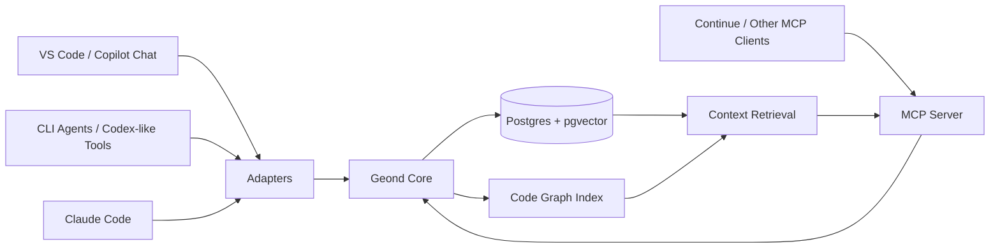
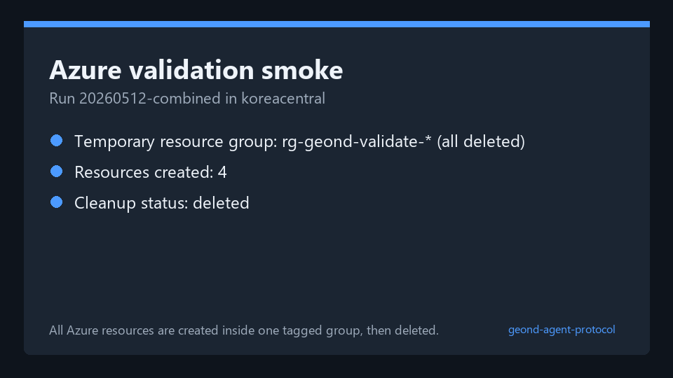
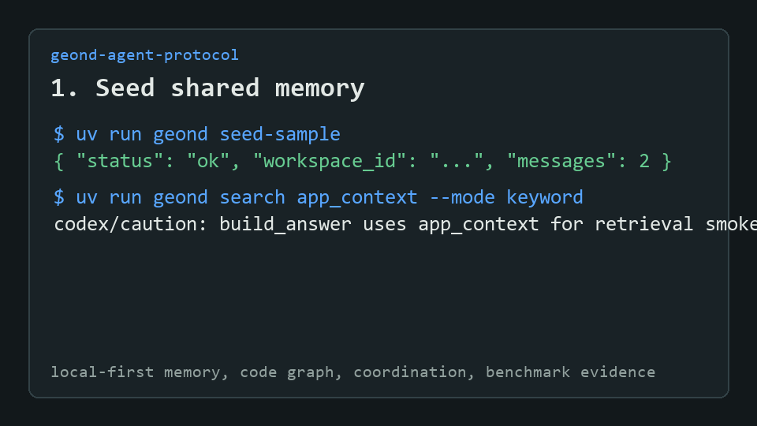

# geond-agent-protocol

A shared memory and code-graph protocol for coding agents.

> **About the name:** Geond is inspired by the Old English root of "beyond". We pronounce it modernly as `/dʒiːɒnd/` ("Jee-ond"). The project helps coding agents go geond their stateless prompt limits by connecting LLMs to local, inspectable development memory, code graphs, and handoff context.

`geond-agent-protocol` is an early-stage open source project for making coding agents share durable development context: chat history, code changes, symbol graphs, decisions, and handoff notes. The goal is not to replace Copilot, Codex, Continue, Cursor, or CLI agents. The goal is to give them a common memory layer they can read from and write to through MCP and lightweight adapters.

## Why

Coding agents are getting better, but their memory is fragmented.

- A VS Code chat may know why a function changed.
- A CLI agent may only see the current files.
- A test agent may not know the design intent behind a change.
- A future session may lose the debugging path that solved the same problem last week.

This project explores a durable local-first context layer where agents can share the same development memory without depending on one specific editor or model provider.

## Core Idea

The protocol stores development events in a local database, then exposes them through MCP tools and resources.



## Planned Capabilities

- Ingest chat sessions, code diffs, file snapshots, and agent actions.
- Parse source files with tree-sitter and store code entities and relationships.
- Retrieve context by semantic similarity, symbol neighborhood, timeline, and change intent.
- Expose shared memory through MCP tools such as `search_dev_memory`, `get_symbol_context`, and `record_agent_action`.
- Help agents coordinate by recording file reservations, active tasks, and handoff notes.
- Provide a local-first Docker setup using Postgres and pgvector.

## Test Beds

The current test beds are VS Code GitHub Copilot Chat, Codex, and Claude Code.
See [docs/agent_testbeds.md](docs/agent_testbeds.md) for the comparison,
validation status, and improvement plan.

## Documentation

- [docs/research_validation.md](docs/research_validation.md) validates the original idea, corrects assumptions, and compares alternatives.
- [docs/architecture.md](docs/architecture.md) describes the proposed system architecture and data model.
- [docs/implementation_plan.md](docs/implementation_plan.md) breaks the work into MVP phases and acceptance criteria.
- [docs/embedding_configuration.md](docs/embedding_configuration.md) explains embedding provider choices and what secrets/configuration are needed.
- [docs/model_provider_strategy.md](docs/model_provider_strategy.md) compares OpenAI, Azure OpenAI, and local SLM embedding options.
- [docs/provider_extensions.md](docs/provider_extensions.md) covers OpenAI, Azure OpenAI, gateway, and local embedding modes.
- [docs/deployment_guide.md](docs/deployment_guide.md) explains Azure CLI and Azure Portal deployment flows with AWS/GCP resource analogues.
- [docs/mcp_client_config.md](docs/mcp_client_config.md) provides Claude Desktop, Continue, and VS Code MCP client examples.
- [docs/benchmarking.md](docs/benchmarking.md) shows the current retrieval benchmark command.
- [docs/azure_validation/README.md](docs/azure_validation/README.md) records the temporary Azure OpenAI, APIM, and VM validation workflow and sanitized evidence.
- [docs/improvement_backlog.md](docs/improvement_backlog.md) lists prioritized next improvements for evidence quality, deployment, retrieval, and adoption.
- [docs/agent_testbeds.md](docs/agent_testbeds.md) compares the Copilot Chat, Codex, and Claude Code test beds.
- [docs/vscode_chat_storage_structure.md](docs/vscode_chat_storage_structure.md) documents the first VS Code Copilot Chat test bed.
- [docs/codex_testbed.md](docs/codex_testbed.md) documents the Codex JSONL test bed.
- [docs/demo.md](docs/demo.md) walks through the current seed, retrieval, code graph, MCP, coordination, and purge demo.
- [docs/public_demo_script.md](docs/public_demo_script.md) provides a ready-to-record public demo/GIF script.

## Quick Start

Create local configuration:

```bash
cp .env.example .env
```

Set `GEOND_EMBEDDING_API_KEY` in `.env`. For the MVP, Geond uses OpenAI `text-embedding-3-small` with 1536-dimensional vectors.

Install dependencies with uv:

```bash
uv sync
```

Enable local pre-commit hooks:

```bash
uv run pre-commit install
uv run pre-commit run --all-files
```

Start Postgres with pgvector:

```bash
docker compose up -d postgres
```

On Windows, make sure Docker Desktop is running before this step.

Apply the initial schema:

```bash
docker compose --profile tools run --rm geond-migrate
```

Insert a small sample workspace and session:

```bash
uv run geond seed-sample
```

Parse a VS Code Copilot Chat workspaceStorage folder without writing to the database:

```bash
uv run geond parse-vscode "C:/path/to/workspaceStorage/<hash>"
```

Import a workspaceStorage folder into Geond:

```bash
uv run geond import-vscode "C:/path/to/workspaceStorage/<hash>" \
    --workspace-uri "file:///C:/path/to/project" \
    --workspace-name "my-project"
```

Parse a Codex session or Codex sessions directory without writing to the database:

```bash
uv run geond parse-codex "C:/Users/<you>/.codex/sessions" --limit 5
```

Import Codex sessions into Geond:

```bash
uv run geond import-codex "C:/Users/<you>/.codex/sessions" \
    --limit 5 \
    --workspace-uri "file:///C:/path/to/project" \
    --workspace-name "my-project"
```

Parse Claude Code sessions without writing to the database:

```bash
uv run geond parse-claude-code "C:/Users/<you>/.claude/projects" --limit 5
```

Import Claude Code sessions into Geond. If `--workspace-uri` and
`--workspace-name` are omitted, Geond derives them from Claude Code's JSONL
`cwd` metadata:

```bash
uv run geond import-claude-code "C:/Users/<you>/.claude/projects" --limit 5
```

Copilot Chat, Codex, and Claude Code imports pass raw event payloads and message content through a conservative redaction baseline before persistence. It masks sensitive keys, environment secret assignments, bearer tokens, GitHub-style tokens, OpenAI-style keys, and URL passwords while recording non-secret redaction metadata in `redaction_findings`.

Repeat imports update existing sessions and remove stale message rows when local session files change. Retrieval snippets are generated in Python so multilingual text is sliced on character boundaries rather than database byte boundaries.

Create embeddings for imported messages:

```bash
uv run geond embed-messages --limit 100
```

Compare keyword, vector, and hybrid retrieval:

```bash
uv run geond search "왜 이 파일이 바뀌었어?" --mode keyword
uv run geond search "왜 이 파일이 바뀌었어?" --mode vector
uv run geond search "왜 이 파일이 바뀌었어?" --mode hybrid
```

Limit retrieval to one workspace or source:

```bash
uv run geond search "추가 테스트베드" \
    --mode keyword \
    --workspace-uri "file:///C:/path/to/project" \
    --source codex
```

Index Python code into the local code graph:

```bash
uv run geond index-python "C:/path/to/project" \
    --workspace-uri "file:///C:/path/to/project" \
    --workspace-name "my-project"
```

Index TypeScript or JavaScript code into the local code graph:

```bash
uv run geond index-ts-js "C:/path/to/project" \
    --workspace-uri "file:///C:/path/to/project" \
    --workspace-name "my-project"
```

Index Python, TypeScript, and JavaScript with the tree-sitter-backed path:

```bash
uv run geond index-tree-sitter "C:/path/to/project" \
    --workspace-uri "file:///C:/path/to/project" \
    --workspace-name "my-project"
```

Use the MCP tool `get_symbol_context` or the Python API to retrieve functions, classes, methods, modules, and imports stored in `code_entities`.

Record a changeset and link it to indexed code entities:

```bash
uv run geond record-changeset \
    --workspace-uri "file:///C:/path/to/project" \
    --workspace-name "my-project" \
    --file "src/service.py" \
    --patch-file "tmp/service.diff" \
    --intent "explain recent service change" \
    --summary "Updated service behavior after agent review."
```

When a unified diff patch is provided, Geond links the changeset to symbols whose
`start_line`/`end_line` overlap the changed hunk range. Deletion-only hunks keep
old-file deleted line metadata and anchor to the new-file line position where the
deletion occurred. Without a patch, Geond falls back to file-path links.

Retrieval outputs include canonical `geond.evidence.v1` evidence references with
stable `target_id`, `locator`, and `metadata` fields. Existing alias fields such
as `message_id`, `changeset_id`, `entity_id`, and `file_path` remain available
for compatibility with early MCP clients.

Run the MCP server:

```bash
uv run geond-mcp
```

Useful MCP resources:

- `geond://sessions`
- `geond://sessions/{session_external_id}`
- `geond://symbols/{symbol}`
- `geond://changesets`
- `geond://workspaces/{workspace_id}/timeline`
- `geond://workspaces/{workspace_id}/reservations`
- `geond://workspaces/{workspace_id}/handoffs`

MCP clients can also call `record_changeset` with `workspace_id` or
`workspace_uri` plus a `files` array. Each file entry supports `file_path`,
`status`, `additions`, `deletions`, `patch`, and `metadata`, matching the CLI
changeset model.

Coordinate symbol-level work from CLI or MCP:

```bash
uv run geond reserve-symbols <workspace-id> \
    --agent-name copilot \
    --symbol build_answer \
    --purpose "rename check"

uv run geond conflicts <workspace-id> --symbol build_answer
```

Leave a handoff summary for the next agent:

```bash
uv run geond record-handoff <workspace-id> \
    --from-agent copilot \
    --to-agent codex \
    --summary "build_answer is indexed; check symbol reservations before editing." \
    --next-step "Run pytest after changing service.py"
```

Benchmark retrieval:

```bash
uv run geond benchmark-search app_context build_answer --mode keyword --repeat 5
```

Run a temporary Azure validation smoke test:

```powershell
.\scripts\azure_validation_smoke.ps1
```

The smoke script creates a tagged temporary resource group, validates Azure OpenAI embeddings, APIM Consumption gateway scaffolding, and a B2s VM multilingual embedding benchmark, then deletes the resource group. Sanitized evidence from the latest validation is in [docs/azure_validation/20260512-combined](docs/azure_validation/20260512-combined).
For a step-by-step CLI and Azure Portal walkthrough, see [docs/deployment_guide.md](docs/deployment_guide.md).

Azure validation evidence:



Delete a workspace and its cascaded local data:

```bash
uv run geond purge-workspace "file:///sample/geond" --yes
```

Clean up expired reservations:

```bash
uv run geond cleanup-reservations --workspace-id "<workspace-id>"
```

Save and compare retrieval benchmarks:

```bash
uv run geond benchmark-search "app_context" "build_answer" \
    --mode keyword \
    --judgments examples/benchmarks/search_judgments.json \
    --save \
    --label baseline

uv run geond benchmark-report --workspace-uri "file:///sample/geond" --format markdown
```

Local protocol demo asset:



## Status

Early MVP stage. The repository contains research notes, architecture, implementation plans, a local Postgres/pgvector schema, VS Code Copilot Chat, Codex, and Claude Code importers, OpenAI/Azure/gateway/local embedding provider modes, keyword/vector/hybrid retrieval, AST/regex/tree-sitter code graph indexing, changeset-to-symbol evidence links, benchmark quality metrics, coordination tools, demo assets, Azure samples, and an MCP server.

## Design Principles

- Local-first by default.
- Explicit capture, not hidden surveillance.
- Agent-agnostic protocol surface.
- Durable memory with reversible provenance.
- Code-aware retrieval, not only text similarity.
- Privacy and redaction as first-class features.

## License

Apache-2.0. See [LICENSE](LICENSE).
