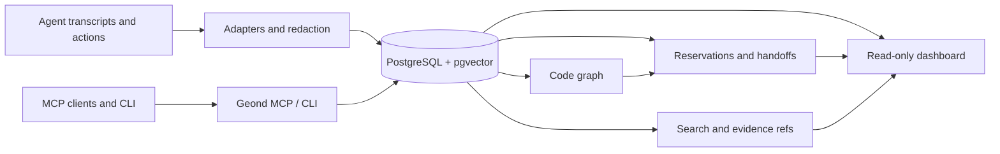

> 语言: [English](README.md) | [한국어](README.ko.md) | [日本語](README.ja.md) | **简体中文** | [Español](README.es.md) | [Français](README.fr.md) | [Deutsch](README.de.md)

# Geond Agent Protocol

[](https://github.com/geondongkim/geond-agent-protocol/actions/workflows/ci.yml)
[](LICENSE)
[](pyproject.toml)

为在同一个仓库中工作的 AI agents 提供共享记忆和协作层。

Geond 让 Copilot Chat、Codex、Claude Code、Antigravity、Manus、CLI agents 和支持 MCP 的工具拥有一个持久的 evidence layer，用来共享发生了什么、为什么这样做、改了什么、哪些文件或符号被预约、如何验证，以及下一个 agent 或 reviewer 应该继续做什么。


Geond 默认是 local-first。你的 editor、CLI、MCP server、dashboard 和 importers 可以在本机连接本地 PostgreSQL 运行。当团队需要多机器协作时，同样的本地进程也可以指向 Azure Database for PostgreSQL 等共享 PostgreSQL-compatible profile。

Geond 目前是 alpha software。以仓库为中心的 memory、MCP、CLI、dashboard read models、reservations、handoffs、code graph indexing、usage evidence、benchmarks 和 shared PostgreSQL validation 已经实现。Enterprise IAM、row-level security、dedicated MCP audit streams、更多 SaaS adapters 和 dependency-expanded automatic reservations 属于 roadmap。

> 关于名称: Geond 来自 "beyond" 的古英语词根，读作 "Jee-ond"。这个项目帮助 agents 超越 stateless prompts，连接到可检查的共享记忆。

## Quick Start

Prerequisites: Python 3.11+, `uv`, Docker with Compose, Git, ripgrep。OS 相关说明见 [docs/developer_setup.md](docs/developer_setup.md)。

```bash
cp .env.example .env
uv sync
docker compose up -d postgres
docker compose --profile tools run --rm geond-migrate
uv run geond doctor --format text
uv run geond seed-sample
uv run geond mcp-smoke --format text --strict
```

启动 MCP server:

```bash
uv run geond-mcp
```

预览或写入 MCP client config:

```bash
uv run geond install --format text
uv run geond install --write
```

启动只读 dashboard:

```bash
uv run geond dashboard serve
```

打开输出中的 localhost URL。更多 MCP client 示例见 [docs/mcp_client_config.md](docs/mcp_client_config.md)。

## What Geond Makes Possible

| Scenario | What you can do | Proof and entrypoint |
| --- | --- | --- |
| AI pair coding across agent tools | 不同 agent tools 可以在同一个 repo 中通过 shared memory、reservations、handoffs 和 review context 进行 pair coding 与分工。已经用 Codex 和 Antigravity 本地验证；同样模式也适用于 Copilot、Claude Code、Continue、Manus 或 custom MCP agents。 | [docs/antigravity_codex_geond_verification.md](docs/antigravity_codex_geond_verification.md), [docs/mcp_client_config.md](docs/mcp_client_config.md) |
| Multi-PC collaboration | Windows、MacBook、CI 或其他队友各自在本地运行 `geond-mcp`、CLI 和 dashboard，同时读写同一个 shared PostgreSQL profile。 | [docs/azure_validation/team_collab_validation.md](docs/azure_validation/team_collab_validation.md), [docs/azure_validation/README.md](docs/azure_validation/README.md) |
| PM and reviewer dashboard | 不需要阅读 raw MCP JSON，也可以查看 agent lanes、sessions、handoffs、changesets、code risk、usage evidence、timeline 和 lineage。 | `uv run geond dashboard serve`, [docs/agent_activity_dashboard.md](docs/agent_activity_dashboard.md) |
| Safe parallel editing | 让 agents review 当前 context、reserve files 或 symbols、record changesets，并在另一个 agent 编辑同一目标前留下 structured handoff。 | [docs/agent_operating_loop.md](docs/agent_operating_loop.md), `uv run geond review-context ...` |
| Cross-agent memory import | 将 Copilot Chat、Codex、Claude Code、Antigravity 和 Manus 的 task evidence redaction 后导入同一个 search/evidence model。 | [docs/agent_testbeds.md](docs/agent_testbeds.md), [docs/manus_integration.md](docs/manus_integration.md) |
| Compact MCP context | 默认返回 snippets、evidence refs、scores 和 follow-up detail paths，而不是把 raw transcripts 全部塞进 LLM context。 | [tests/test_mcp_payload_budget.py](tests/test_mcp_payload_budget.py), [docs/ai_usage_observability.md](docs/ai_usage_observability.md) |

## Demo GIFs

这些 GIF 来自 sanitized scenario text，不包含 private transcripts。重新生成:

```bash
uv run python scripts/render_readme_gifs.py
```


更多 browser-verified dashboard captures 和 terminal demo notes 见 [docs/public_demo_script.md](docs/public_demo_script.md)。

## Learning Path

从 [learn/README.md](learn/README.md) 开始，按 notebook 学习 README 中的场景。

| Lesson | Focus |
| --- | --- |
| [01 Local Shared Memory](learn/01_local_shared_memory.ipynb) | 运行本地 PostgreSQL，seed sample evidence，搜索 memory，并执行 MCP smoke test。 |
| [02 Handoffs And Reservations](learn/02_handoffs_and_reservations.ipynb) | 练习 context review、symbol reservations、conflicts 和 handoff packets。 |
| [03 AI Pair Coding Workflow](learn/03_ai_pair_coding_workflow.ipynb) | 让 Agent A 与 Agent B 使用不同 agent tools 共享 evidence。 |
| [04 Shared PostgreSQL Team Mode](learn/04_shared_postgres_team_mode.ipynb) | 理解用于多 PC 协作的 optional shared PostgreSQL profiles。 |

## How It Works



1. Memory: importers normalize sessions、events、messages、usage records 和 task history，并在保存前 redact common secrets。
1. Code graph: Python、TypeScript 和 JavaScript indexers 连接 files、symbols、imports、calls、references 和 changesets。
1. Reservations: agents 可以创建带 TTL、policy checks、renewals、releases 和 auditable events 的 file/symbol claims。
1. Handoffs: agents 留下包含 tested commands、blockers、remaining risks 和 evidence refs 的 next-action packets。
1. Dashboard: humans 和 PM/orchestrator agents 查看 overview、activity、timeline、code risk、usage、lineage、reservations 和 handoff read models。
1. Shared PostgreSQL: local-first setup 使用 Docker PostgreSQL；team profiles 可以指向 Azure 或其他 PostgreSQL-compatible backend。

## Common Workflows

| Goal | Command or doc |
| --- | --- |
| Check environment | `uv run geond doctor --format text` |
| Import Copilot Chat | `uv run geond import-vscode <workspaceStorage-or-session-path>` |
| Import Codex | `uv run geond import-codex <codex-sessions-dir> --workspace-uri <uri>` |
| Import Claude Code | `uv run geond import-claude-code <claude-projects-dir> --workspace-uri <uri>` |
| Import Antigravity | `uv run geond import-antigravity <storage-path> --workspace-uri <uri>` |
| Import Manus task | `uv run geond import-manus-task <task-id> --workspace-uri <uri>` |
| Search memory | `uv run geond search "why did this change" --mode hybrid` |
| Index code | `uv run geond index-tree-sitter <path>` |
| Record a changeset | `uv run geond record-changeset <workspace-id-or-uri> ...` |
| Reserve work | `uv run geond reserve-files ...` or `uv run geond reserve-symbols ...` |
| Review conflicts | `uv run geond review-context <workspace-id-or-uri> --format markdown` |
| Leave handoff | `uv run geond record-handoff <workspace-id-or-uri> ...` |
| Agent operating loop | [docs/agent_operating_loop.md](docs/agent_operating_loop.md) |
| MCP clients | [docs/mcp_client_config.md](docs/mcp_client_config.md) |

更完整的 demo path 见 [docs/demo.md](docs/demo.md)。

## Shared Team Database

默认本地 database 使用 `GEOND_DATABASE_URL`。如果要保留本地进程，同时让多台机器共享 memory，可以添加第二个 profile。

```bash
GEOND_DATABASE_PROFILE=azure
AZURE_GEOND_DATABASE_URL=postgresql://...
```

Dashboard 会在不显示 user info、password 或 token 的情况下，将 active source 分类为 local PostgreSQL、Azure PostgreSQL 或 remote PostgreSQL。验证过的 team flow 记录在 [docs/azure_validation/team_collab_validation.md](docs/azure_validation/team_collab_validation.md)。

## Documentation

- [docs/architecture.md](docs/architecture.md): system layers 和 data model。
- [docs/agent_activity_dashboard.md](docs/agent_activity_dashboard.md): dashboard read models 与 PM/orchestrator views。
- [docs/agent_operating_loop.md](docs/agent_operating_loop.md): agents 的 read、reserve、record、handoff loop。
- [docs/agent_testbeds.md](docs/agent_testbeds.md): Copilot Chat、Codex、Claude Code、Antigravity test beds。
- [docs/manus_integration.md](docs/manus_integration.md): Manus API v2 import、context packets、task contracts 和 limitations。
- [docs/mcp_client_config.md](docs/mcp_client_config.md): VS Code、Claude Desktop、Continue、Antigravity 和其他 MCP client setup。
- [learn/README.md](learn/README.md): notebook-based onboarding path。

## Security And Privacy

Geond 面向 local-first 使用。Importers 在保存前 redact common secrets，external embeddings 是 opt-in，dashboard 不暴露 credential-bearing connection strings。即便如此，agent transcripts 仍可能包含 sensitive information。分享 `.env`、transcripts、screenshots、benchmark logs 或 dashboard captures 前请先检查。

## License

Apache-2.0. See [LICENSE](LICENSE).
