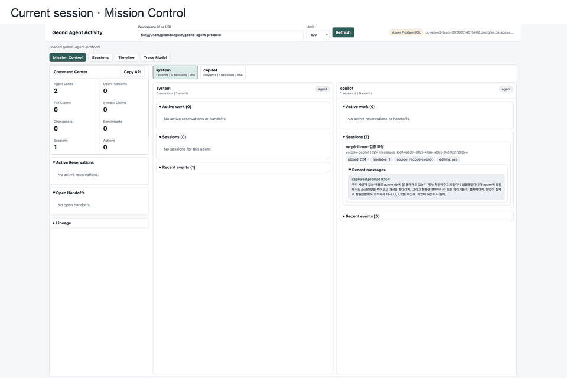

# Agent Activity Dashboard

This note defines a concrete product direction for an optional Geond web app.
The dashboard is not an MCP tool. It is a read-only, local-first observer that
renders the same database evidence that MCP tools already expose to agents.

## Product Thesis

Geond should answer one operational question at a glance:

> Which agent is doing what, why is it doing it, what did it claim, what did it
> change, and what should the next agent or human review next?

The current protocol already stores most of the required evidence: sessions,
events, messages, agent actions, file and symbol reservations, reservation audit
events, handoff summaries, changesets, symbol links, lineage graphs, benchmark
runs, and redaction findings. The dashboard should first be a clear read model
over those tables, then grow into a control surface only after the read path is
boringly reliable.

## Design Inputs

The dashboard direction comes from five recurring needs in multi-agent coding
workflows:

- a mission-control view that makes agent ownership, blockers, and next actions
  visible without reading raw JSON
- horizontally expanding agent lanes so adding agents does not make the primary
  page taller
- session cards that surface the recent chat/context that caused the current
  work
- a provenance graph that separates append-only evidence from reduced UI state
- lifecycle hooks and adapters that can record explicit agent activity without
  capturing every keystroke
- a handoff lifecycle model that lets PM/orchestrator agents reason about
  open, blocked, consumed, and released work

## Non-Goals

- Do not turn Geond into an agent runner in the first dashboard slice.
- Do not require a cloud account or remote sync service.
- Do not make MCP clients depend on the dashboard.
- Do not capture every keystroke. Activity should come from explicit events,
  imports, hooks, reservations, handoffs, changesets, and benchmark records.
- Do not expose secrets or raw auth tokens in the UI.

## MVP Views

### View Semantics

Agent lanes, sessions, and relationship traces answer different collaboration
questions and should stay visually distinct.

- Agent lanes are the operational board: current owner, live claims, open
  handoffs, blockers, and the latest evidence that an agent is active.
- Sessions are the transcript evidence board: what the human asked, what the
  agent answered, and which recent stored messages are only technical trace.
- Relationships are the bounded connector view: agents linked to sessions,
  agents linked to active work, and sessions linked to timeline events.

For day-to-day coordination, PM/orchestrator users should start in Agent Lanes.
For review, debugging, or handoff confidence, they should open Sessions. A lane
without sessions is weak evidence; a session without claims or handoffs is useful
history but not enough to coordinate parallel work.

### 1. Command Center

Purpose: make the current workspace state scannable in five seconds.

Show:

- active agents and their latest action
- active file and symbol reservations
- open handoffs and blockers
- latest changesets and touched symbols
- latest benchmark or validation result
- ingestion and redaction health

Primary interaction: click any row to open a right-side evidence panel.

### 2. Agent Fleet

Purpose: answer "what is each agent doing?"

Horizontal lanes:

- agent name and kind
- status inferred from recent actions and open reservations
- current intent or latest action summary
- active session, if known
- reserved files and symbols
- open handoffs from or to the agent
- last seen time

Detail panel:

- recent actions
- sessions and messages snippets
- reservations and expiry
- handoffs, tested commands, risks, next action
- changesets associated with the agent or session

Layout rule: agent count expands the board horizontally. The primary mission
control page should avoid whole-page vertical scroll; each lane owns its own
small scroll area and collapsible groups.

### 3. Activity Timeline

Purpose: explain causality without reading raw tables.

Rows should merge:

- sessions
- agent actions
- reservation create, renew, release, and expire events
- handoff create and close events
- changesets
- benchmark runs
- redaction findings grouped by source

Filters: agent, kind, status, file path, symbol, source, time range.

### 4. Collaboration Graph

Purpose: visualize who handed off to whom, which session produced which
changeset, and which code symbols were touched.

Nodes:

- agent
- session
- action
- handoff
- reservation
- changeset
- benchmark run
- code entity

Edges:

- `session_contains`
- `handoff_from`
- `handoff_to`
- `reserves`
- `touches`
- `calls` / `references`
- `validates`
- `precedes`

The graph should be useful, not decorative. The default layout should limit
node count and offer filters before any full-graph view.

### 5. Handoff Board

Purpose: make next-agent work executable.

Lanes:

- open
- blocked
- ready for review
- consumed / closed

Cards show summary, from/to agent, next action, blockers, tested commands,
remaining risks, and evidence refs.

### 6. Code Risk Map

Purpose: help agents avoid stepping on each other.

Show files and symbols with:

- active reservations
- recent changesets
- caller/callee or reference fan-out
- open handoffs mentioning the same target
- failed or stale validation signals

This can begin as a sortable table before becoming a graph or heatmap.

## Data Sources Already Available

Existing schema tables cover the MVP read model:

- `workspaces`, `workspace_aliases`, `workspace_fingerprints`
- `agents`, `sessions`, `events`, `messages`
- `agent_actions`
- `file_reservations`, `symbol_reservations`, `reservation_events`
- `handoff_summaries`
- `changesets`, `change_files`, `change_entities`
- `code_entities`, `code_edges`
- `benchmark_runs`
- `redaction_findings`

Existing MCP/resource functions already provide useful dashboard-shaped
payloads:

| Collaboration question | Agent MCP read/write path | Human web view |
| --- | --- | --- |
| What happened before? | `search_dev_memory`, `geond://sessions`, `geond://sessions/{id}` | Sessions shows user prompts, captured prompts, agent replies, readable excerpts, and technical trace counts. |
| What code or symbol is involved? | `get_symbol_context`, `geond://symbols/{symbol}`, `explain_change`, `get_changeset_detail` | Project Structure and future code-risk views show hot files, symbols, changesets, and impact. |
| Who is working now? | `get_dashboard_overview`, `get_agent_activity_events`, `record_agent_action` | Agent Lanes show active agents, latest activity, and compact evidence sessions. |
| Is there a conflict? | `review_workspace_context`, workspace `reservations`, `get_symbol_conflicts` | Active Reservations and Agent Lanes show current file/symbol claims and blockers. |
| What should the next agent do? | `record_handoff_summary`, `list_handoff_summaries`, `close_handoff_summary` | Open Handoffs and Relationships show from/to agents, next action, tested commands, and risk context. |
| What changed and why? | `record_changeset`, `geond://changesets`, workspace `timeline`, `lineage` | Timeline and Relationships connect sessions, changesets, handoffs, and validation events. |

The intended loop is simple: an agent reads memory, code evidence, reservations,
handoffs, and lineage before editing; it records an action or reservation when
it starts; it records a changeset and handoff when it finishes or pauses. The
human does not need to read MCP JSON. The web app turns that same evidence into
operational choices: continue the current lane, inspect a session, review a
handoff, ask an agent to release or renew a claim, or open the git diff for the
actual code review.

## Current Local UI Slice

The local dashboard now exposes the active database source in both `/health` and
`/api`, then renders it as a header badge. The badge intentionally reports only
safe metadata: source classification, host, database name, and `sslmode`. It is
designed to make local Docker PostgreSQL and Azure PostgreSQL runs obvious to a
human reviewer without leaking the connection password.

The Mission Control view also includes an agent switchboard above the horizontal
lanes. Each chip summarizes an agent's event count, session count, and active
work, then scrolls the board to that agent. This keeps the dashboard usable as
Azure-backed shared memory starts showing multiple agents from different
machines.

The UI now starts from `/api/workspaces` instead of requiring an operator to
paste a workspace id. Each option shows the workspace name, short id, session
count, message count, and observed agents; selecting a workspace refreshes the
overview, activity stream, sessions, and project structure together. The default
window is 100 records, and a small polling control refreshes the page every few
seconds for live PM/orchestrator observation.

The Mission Control side panel includes a project-structure activity map from
indexed code entities, change files, and active reservations. It highlights
changed files, symbol counts, active claims, responsible agents, and last change
time so a PM or orchestration agent can spot hot files without reading raw
changeset JSON.



The Azure validation slice exercises all four dashboard views against shared
PostgreSQL memory. Mission Control shows cloud-backed agent lanes and handoffs,
Sessions filters VS Code/Copilot technical metadata so recent human-readable
prompts remain visible, Timeline shows normalized evidence, and Trace Model
summarizes shared-memory source, evidence coverage, and coordination readiness.
The readiness panel intentionally warns when a workspace has sessions but no
active handoffs or reservations, because that state is readable but weak for
multi-agent collaboration.

The current dashboard makes this split explicit in the UI. Mission Control keeps
full chat cards out of the agent lanes and shows compact evidence-session links
instead, while the Sessions view expands readable user prompts, captured prompts,
agent replies, and technical-message counts. The Relationships view replaces the
older static trace placeholder with bounded rows for agent-to-session,
agent-to-work, and evidence-to-timeline links. The Handoffs view groups
structured handoff summaries by originating agent and status, including next
steps, blockers, tested commands, and remaining risks when agents record them.
The Code Risk view starts as a bounded hot-file table built from active claims,
recent changesets, code graph fan-out, and open handoff mentions. The Changesets
view groups recent changesets by branch with changed files, linked entity counts,
and additions/deletions for focused review. The same read models are available
to automation through `dashboard-code-risk` and `dashboard-changesets`.

- `geond://sessions`
- `geond://workspaces/{workspace_id}/timeline`
- `geond://workspaces/{workspace_id}/lineage`
- `geond://workspaces/{workspace_id}/reservations`
- `geond://workspaces/{workspace_id}/handoffs`
- `get_workspace_lineage_graph`
- `review_workspace_context`

The first dashboard should wrap these read paths rather than inventing a
parallel state model.

## Proposed HTTP API

Start with a localhost-only, read-only service:

```text
GET /healthz
GET /readyz
GET /api/workspaces
GET /api/workspaces/{workspace_id}/overview
GET /api/workspaces/{workspace_id}/agents
GET /api/workspaces/{workspace_id}/sessions?limit=50&message_limit=5
GET /api/workspaces/{workspace_id}/project?limit=100
GET /api/workspaces/{workspace_id}/usage
GET /api/workspaces/{workspace_id}/timeline?limit=100&after=<cursor>
GET /api/workspaces/{workspace_id}/lineage?limit=250
GET /api/workspaces/{workspace_id}/reservations
GET /api/workspaces/{workspace_id}/handoffs?status=open
GET /api/workspaces/{workspace_id}/changesets?limit=50
GET /api/workspaces/{workspace_id}/code-risk?limit=100
GET /api/workspaces/{workspace_id}/review-context?intent=...&file=...&symbol=...
```

Live updates can start with client polling. Add this later:

```text
GET /api/workspaces/{workspace_id}/events/stream
```

The stream can initially poll the latest `created_at` from timeline-compatible
tables. A later version can use Postgres `LISTEN/NOTIFY` or an append-only
`agent_activity_events` table.

## Activity Event Normalization

The existing tables are enough for a read-only MVP, but orchestration will need
a single event vocabulary. Add a normalized projection after the dashboard MVP:

```text
agent_activity_events
- id
- workspace_id
- agent_id
- session_id
- event_type
- status
- summary
- subject_type
- subject_id
- evidence_refs
- occurred_at
- metadata
```

This projection can be built from `agent_actions`, `reservation_events`,
`handoff_summaries`, `changesets`, `benchmark_runs`, and imported agent
transcript events. It should follow the rollout-trace principle: keep raw
evidence first, then reduce into dashboard state.

## Frontend Direction

Use an operational dashboard, not a marketing page.

Recommended stack:

- Vite + React + TypeScript for a small local app.
- TanStack Query or a small typed fetch layer for cache/polling.
- Tailwind or existing shadcn-style primitives for compact controls.
- Lucide icons for actions and status.
- Recharts or lightweight SVG charts for metrics.
- React Flow, Cytoscape, or a restrained force graph for lineage; avoid 3D as
  the default operational graph until there is a real need.

UX rules:

- First screen is the Command Center, not a landing page.
- Use tabs to split mission control, sessions, timeline, and trace/graph views.
- Use horizontally scrolling agent and session lanes instead of one long page.
- Use dense tables, filters, segmented controls, and right-side detail panels
  only when they reduce scanning cost.
- Collapse long sections by default: graph details, event history, and old
  handoffs should not crowd the mission-control lane.
- Keep cards for repeated summary items only; do not nest cards.
- Use functional colors: green for healthy/completed, amber for waiting, red for
  failed/conflict, blue/teal for active, gray for archived.
- Never show raw tokens or secrets.
- Default to evidence snippets and clickable refs instead of long raw payloads.

## PM Agent Use

A PM agent can use the dashboard API as a project-state read model:

- detect idle agents or stale reservations
- identify blockers from open handoffs
- summarize the last 24 hours of changesets, tests, and handoffs
- propose next tasks based on code-risk hotspots and open next actions
- ask a coding agent to consume a specific handoff package
- produce a human status report with evidence refs

The PM agent should not need database credentials. It should read the same
localhost API that the UI reads.

## Orchestration Use

An orchestrator can use the dashboard read model to schedule work safely:

- check reservations before assigning a file or symbol
- route work to agents with matching recent context
- require a handoff package before switching owners
- pause or escalate work when conflict policy blocks a reservation
- use benchmark and validation runs as readiness signals
- keep a global timeline for audit and replay

For this to work well, Geond needs standardized activity event names and agent
adapters that record lifecycle events consistently.

## Pair-Coding Use

For two coding agents working together, the dashboard becomes shared situational
awareness:

- each agent sees the other's active claims and latest intent
- pair agents can intentionally co-own a handoff instead of colliding silently
- review agents can jump from a changeset to touched symbols, call impact, and
  the handoff that requested the work
- a human can inspect whether an agent followed the previous next action

This is the concrete version of Geond's collaboration thesis: not just shared
memory, but visible work state.

## Execution Ideas

1. Build a simulated two-agent demo with `seed-sample`, `record_agent_action`,
   `reserve-symbols`, `record-handoff`, `record-changeset`, and `benchmark-search`.
2. Continue with `geond dashboard serve` as a single-command local UI before
   extracting a Vite/React app.
3. Render a new GIF: dashboard opens, shows two or more horizontal agent lanes,
   one reservation, one
   handoff, a timeline item, and a lineage graph.
4. Add optional Claude Code and Codex hook examples that write Geond activity
   events at session start, tool use, validation, stop, and compaction.
5. Add a PM-agent prompt example that consumes `/overview`, `/handoffs`, and
   `/code-risk` and returns a next-work plan.
6. Add an orchestrator dry-run command that prints which files/symbols are safe
   to assign.

## Roadmap

| Slice | Goal | Acceptance criteria |
| --- | --- | --- |
| 0. Product docs | Align on dashboard shape. | This document, README link, backlog entry, and demo-script note exist. |
| 1. Read model | Expose dashboard-shaped JSON from existing repository functions. | Implemented through `dashboard-overview`, `dashboard-events`, `get_dashboard_overview`, `get_agent_activity_events`, `geond://workspaces/{id}/overview`, and `geond://workspaces/{id}/activity`. |
| 1.5. Local HTTP API | Serve the same read model over localhost. | Implemented as `geond dashboard serve` with `/health`, `/api/workspaces`, `/api/workspaces/{id}/overview`, `/activity`, `/sessions`, `/project`, `/timeline`, `/lineage`, `/reservations`, and `/handoffs`. |
| 2. Local UI MVP | Render command center, timeline, agent fleet, handoffs, lineage graph, and usage evidence. | Mission Control, workspace selector, live polling, project-structure activity, horizontally expanding Agent Fleet lanes, session/message cards, reservations, handoff-board status lanes, Code Risk hot files, Changesets review lanes, lineage counts, Activity Timeline, trace-model tab, `/api/workspaces/{id}/usage`, a Usage Evidence tab, and CLI usage risk signals are served; next add richer collaboration graph views. |
| 3. Activity projection | Normalize agent activity events for UI and orchestrators. | Agent actions, reservations, handoffs, changesets, and benchmark runs reduce into one ordered event stream. |
| 4. Hook adapters | Capture real agent lifecycle events. | Codex/Claude Code hook examples record session/tool/stop events without exposing secrets. |
| 5. PM/orchestrator loop | Use the read model to guide work assignment. | A PM prompt and CLI dry-run can recommend next work, detect blockers, and cite evidence. |
| 6. Trust controls | Make local observation safe for public demos. | Read-only mode, localhost binding, CORS guardrails, redaction summaries, and retention settings are documented and tested. |

## Recommended Next Slice

Add richer code-risk views next. The first local UI now renders split pages with
Mission Control, workspace selection, live refresh, project-structure activity,
horizontally expanding Agent Fleet lanes, session/message cards, reservations,
handoffs, lineage counts, Activity Timeline, and a trace-model tab over the same
read-only payloads.
