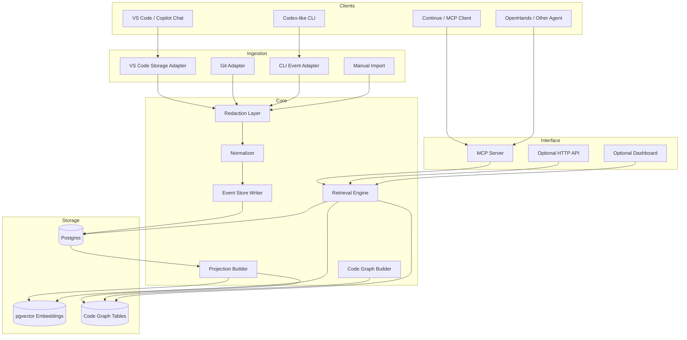

# Architecture

`geond-agent-protocol` is a local-first shared memory layer for coding agents. It stores development events, derives code-aware context, and exposes that context through MCP.

## 1. System Goals

- Let multiple coding agents share durable context across tools and sessions.
- Preserve why code changed, not only what changed.
- Combine chat history, diffs, file snapshots, AST symbols, test results, and agent actions.
- Provide a standard MCP interface so clients can adopt it without custom integrations.
- Keep local development data private by default.

## 2. Non-Goals

- Do not replace existing coding agents.
- Do not fork Copilot, Codex, Continue, Cursor, or OpenHands for the MVP.
- Do not depend on private VS Code storage formats as a stable public API.
- Do not require fine-tuning or cloud services for the first version.
- Do not capture every keystroke.

## 3. High-Level Architecture



## 4. Layers

### 4.1 Adapters

Adapters translate external tool data into Geond events.

Initial adapters:

- VS Code Copilot Chat storage adapter
  - Reads `chatSessions`, `chatEditingSessions`, `GitHub.copilot-chat/transcripts`, and `state.vscdb`.
  - Used as a test bed, not treated as a stable public API.
- Git adapter
  - Captures commit id, branch, diff, staged/unstaged state, and file status.
- CLI event adapter
  - Receives explicit events from command-line agents.
- Manual import
  - Imports JSONL, Markdown, or exported chat logs.

### 4.2 Redaction Layer

The redaction layer runs before persistence.

Responsibilities:

- Detect secrets such as API keys, tokens, private keys, `.env` values, and connection strings.
- Apply workspace allowlist/denylist rules.
- Mark raw payloads as retained, redacted, or discarded.
- Keep enough provenance to explain retrieval results without exposing sensitive data.

### 4.3 Event Store

All raw or normalized inputs become append-only events first.

Example event types:

- `session.started`
- `message.created`
- `tool.called`
- `tool.completed`
- `file.snapshot.captured`
- `file.diff.created`
- `agent.action.recorded`
- `test.result.recorded`
- `summary.created`

Append-only storage gives two benefits:

- The system can rebuild projections when parsers improve.
- Historical causality is preserved for “why did this change?” queries.

### 4.4 Projection Builder

Projections convert events into queryable tables.

Important projections:

- sessions and messages
- changesets and file snapshots
- code entities and code edges
- agent actions and handoffs
- embeddings and summaries
- active reservations
- reservation audit events
- workspace aliases and fingerprints for renamed or moved local folders

### 4.5 Code Graph Builder

The code graph builder parses files and creates structural relationships.

MVP parsing strategy:

- Use lightweight language-specific extractors first: Python via stdlib `ast`, and
  TypeScript/JavaScript via a conservative declaration scanner.
- Python and TypeScript/JavaScript indexing record intra-file calls and resolve
  cross-file calls when a function or method calls a symbol imported with
  absolute imports, package-relative imports, named imports, or namespace
  imports.
- The TypeScript/JavaScript fallback maps default import aliases to named
  default-export functions/classes when the target module is indexed.
- The TypeScript/JavaScript fallback also records re-export barrel declarations
  and resolves named, default-as, and unambiguous wildcard re-export call edges
  back to their source symbols.
- Use tree-sitter where available and keep language fallbacks for unsupported
  syntax. The TypeScript/JavaScript fallback infers function, class, method,
  and module line spans so diff hunks can link to body changes, not only
  declaration lines.
- Later add LSP-based references when available.

Entity examples:

- file
- module
- class
- function
- method
- variable
- route/endpoint
- test case

Edge examples:

- `defines`
- `calls`
- `imports`
- `inherits`
- `implements`
- `tests`
- `modified_by`
- `mentioned_in`
- `explained_by`

### 4.6 Retrieval Engine

Retrieval combines four signals.

| Signal | Purpose |
|---|---|
| Semantic similarity | Find related conversations, snippets, and summaries |
| Lexical indexes | Fast token and substring matching with Postgres GIN, full-text search, and `pg_trgm` |
| Symbol graph | Expand context around functions/classes/modules |
| Timeline | Recover the sequence of decisions and changes |
| Intent | Prioritize bugfix, refactor, feature, test, or docs context |

Retrieval should return structured context, not only text chunks.
Symbol context includes related changesets plus caller/callee relationships from
`calls` edges when the code graph can resolve them.
Change explanations and changeset detail records include `call_impact`, allowing
deterministic narratives to cite upstream callers and downstream callees.
Workspace-scoped retrieval resolves registered `workspace_aliases`, so a moved
folder can keep using the original workspace memory. `workspace_fingerprints`
stores conservative identity hints such as sanitized git remote URL and first
commit, plus root manifest file hashes and package-name hashes, allowing clients
to ask for alias suggestions before registering one.

Example response shape:

```json
{
  "query": "why did mock_exam.py change?",
  "contexts": [
    {
      "kind": "change_explanation",
      "confidence": 0.84,
      "files": ["app/services/mock_exam.py"],
      "symbols": ["generate_mock_exam"],
      "messages": ["session:da185113..."],
      "summary": "The file changed while fixing a Flask application context issue..."
    }
  ]
}
```

## 5. Proposed Database Model

Core tables:

```text
workspaces
agents
sessions
messages
events
artifacts
file_snapshots
changesets
change_files
code_entities
code_edges
change_entities
embeddings
summaries
agent_actions
file_reservations
symbol_reservations
reservation_events
handoff_summaries
benchmark_runs
retrieval_events
redaction_findings
workspace_aliases
workspace_fingerprints
```

### 5.1 Key Tables

`workspaces`

- `id`
- `root_uri`
- `name`
- `created_at`
- `metadata`

`workspace_aliases`

- `workspace_id`
- `alias_uri`
- `reason`
- `metadata`
- `last_seen_at`

`workspace_fingerprints`

- `workspace_id`
- `fingerprint_type`
- `fingerprint_value`
- `metadata`
- `last_seen_at`

`reservation_events`

- `workspace_id`
- `reservation_kind` (`file` or `symbol`)
- `reservation_id`
- `agent_id`
- `action` (`created`, `renewed`, `released`, `expired`)
- `subject`
- `metadata`
- `created_at`

`sessions`

- `id`
- `workspace_id`
- `source` (`vscode-copilot`, `codex`, `continue`, `manual`)
- `external_id`
- `title`
- `started_at`
- `ended_at`
- `metadata`

`messages`

- `id`
- `session_id`
- `role`
- `content`
- `created_at`
- `raw_event_id`
- `metadata`

`changesets`

- `id`
- `workspace_id`
- `session_id`
- `git_commit`
- `branch`
- `intent`
- `summary`
- `created_at`

`code_entities`

- `id`
- `workspace_id`
- `snapshot_id`
- `kind`
- `name`
- `qualified_name`
- `file_path`
- `start_line`
- `end_line`
- `signature`
- `metadata`

`code_edges`

- `id`
- `workspace_id`
- `source_entity_id`
- `target_entity_id`
- `edge_type`
- `confidence`
- `metadata`

`change_entities`

- `id`
- `workspace_id`
- `changeset_id`
- `change_file_id`
- `code_entity_id`
- `match_type` (`line_range` when a unified diff hunk overlaps an indexed symbol, otherwise `file_path`)
- `confidence`
- `metadata` (`changed_start_line`, `changed_end_line`, hunk metadata, and link source when available)

This table links changed files to indexed symbols so `explain_change` and
`get_symbol_context` can return concrete evidence about which functions,
classes, or modules were touched by a changeset.

When a unified diff is available, `line_range` links preserve hunk metadata in
`metadata`: `hunk_index`, old/new range bounds, `change_kind`, and changed line
anchors. Deletion-only hunks are represented as `change_kind = deletion_only`,
anchor to the new-file line position where the deletion occurred, and retain
`deleted_start_line`/`deleted_end_line` from the old file.

### 5.2 Evidence References

MCP and Python retrieval APIs return canonical evidence references with schema
`geond.evidence.v1`. Every evidence reference has a stable top-level shape:

```json
{
  "schema": "geond.evidence.v1",
  "kind": "changeset",
  "target_id": "...",
  "workspace_id": "...",
  "workspace_uri": "file:///project",
  "source": "vscode-copilot",
  "locator": {
    "file_path": "src/service.py",
    "change_file_id": "...",
    "git_commit": "..."
  },
  "metadata": {
    "match_type": "line_range",
    "link_metadata": {
      "change_kind": "deletion_only",
      "changed_start_line": 42,
      "deleted_start_line": 41
    }
  }
}
```

Older alias fields such as `message_id`, `changeset_id`, `entity_id`, and
`file_path` remain present for compatibility, but MCP clients should prefer the
canonical `target_id`, `locator`, and `metadata` fields.

`agent_actions`

- `id`
- `workspace_id`
- `agent_id`
- `session_id`
- `action_type`
- `intent`
- `status`
- `summary`
- `created_at`

`file_reservations`

- `id`
- `workspace_id`
- `agent_id`
- `file_path`
- `purpose`
- `expires_at`
- `released_at`

## 6. MCP Interface

### 6.1 Tools

`ingest_vscode_copilot_session`

- Imports one VS Code Copilot Chat session from a workspaceStorage path.

`index_workspace`

- Parses files, builds code entities, and updates code graph projections.

`search_dev_memory`

- Searches chat, code, diffs, summaries, and symbols.

`get_symbol_context`

- Returns symbol definition, references, neighbors, related changes, and related sessions.

`explain_change`

- Given a file path, symbol, or git diff, returns the likely reason and supporting evidence.
- With `include_narrative=true`, attaches a deterministic, evidence-citing summary (schema `geond.evidence.v1.narrative`) so consumers can read a one-paragraph briefing without paging through every row.

`get_changeset_detail`

- Looks up a changeset by UUID or git commit (sha or prefix) and returns files, touched code entities, and `geond.evidence.v1` evidence refs. Supports `include_narrative` for a cite-able summary.

`record_agent_action`

- Writes what an agent is doing, why, and which files/symbols are involved.

`record_changeset`

- Records changed files and optional unified diff patches directly from an MCP
  client, then links patch hunks to indexed code entities.

`reserve_files`

- Marks files as actively edited by an agent to reduce collision risk.

`reserve_symbols`

- Marks symbols as actively edited by an agent and returns active symbol conflicts.

`get_symbol_conflicts`

- Lists active symbol reservations for a workspace or requested symbol set.

`release_reservation`

- Releases a reservation when an agent finishes or aborts.

`release_symbol_reservation`

- Releases a symbol reservation when the agent finishes or aborts symbol-level work.

`record_handoff_summary`

- Stores a concise transfer note, next steps, and blockers for the next agent.

`list_handoff_summaries`

- Lists open or closed handoff summaries.

`summarize_project_state`

- Creates a compact current-state brief for another agent.

### 6.2 Resources

- `geond://workspaces`
- `geond://workspaces/{workspace_id}/timeline`
- `geond://workspaces/{workspace_id}/reservations`
- `geond://workspaces/{workspace_id}/handoffs`
- `geond://sessions/{session_id}`
- `geond://symbols/{entity_id}`
- `geond://changesets/{changeset_id}`
- `geond://agents/{agent_id}/actions`

## 7. Deployment Architecture

MVP Docker Compose services:

```text
postgres      Postgres with pgvector
mcp-server    Geond MCP server
worker        Optional ingestion/indexing worker
dashboard     Optional local web UI, later phase
```

The first public demo should run with one command:

```bash
docker compose up
```

Then users can connect an MCP client to the Geond MCP server.

## 8. Security and Privacy

Minimum requirements:

- Local-only by default.
- No telemetry by default.
- Explicit import paths.
- Secret redaction before storage.
- Workspace purge command.
- Clear distinction between raw payloads and derived summaries.
- Optional external embedding provider, disabled by default.

## 9. First Demo Scenario

1. Import a recovered VS Code Copilot Chat session.
2. Import related git diff or file snapshots.
3. Parse changed Python files with tree-sitter.
4. Ask through MCP: “Why did this file change?”
5. Geond returns chat evidence, diff evidence, and symbol context.

This demo proves the core value: another agent can understand prior work without the user manually re-explaining it.
