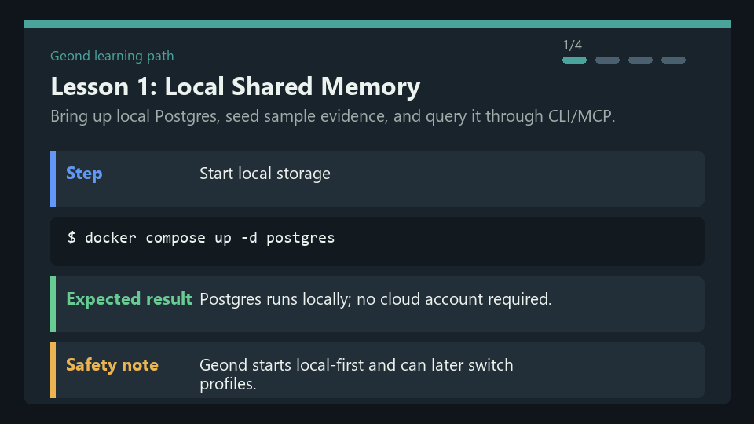
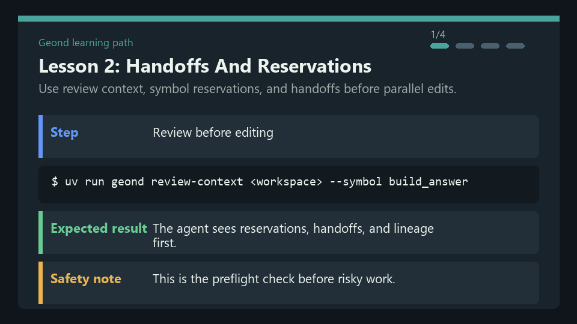
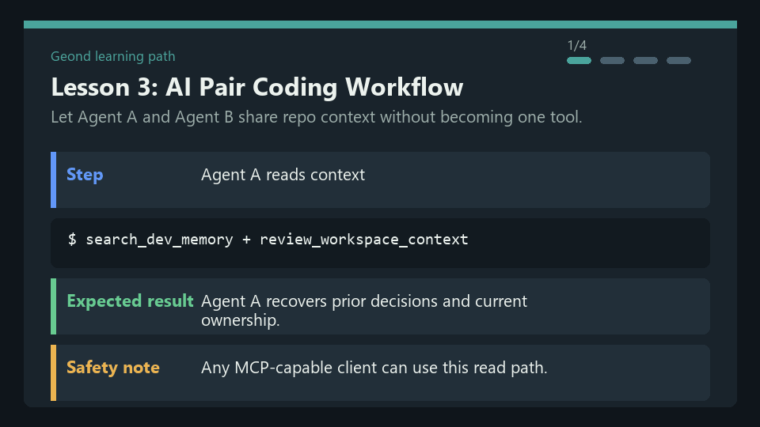
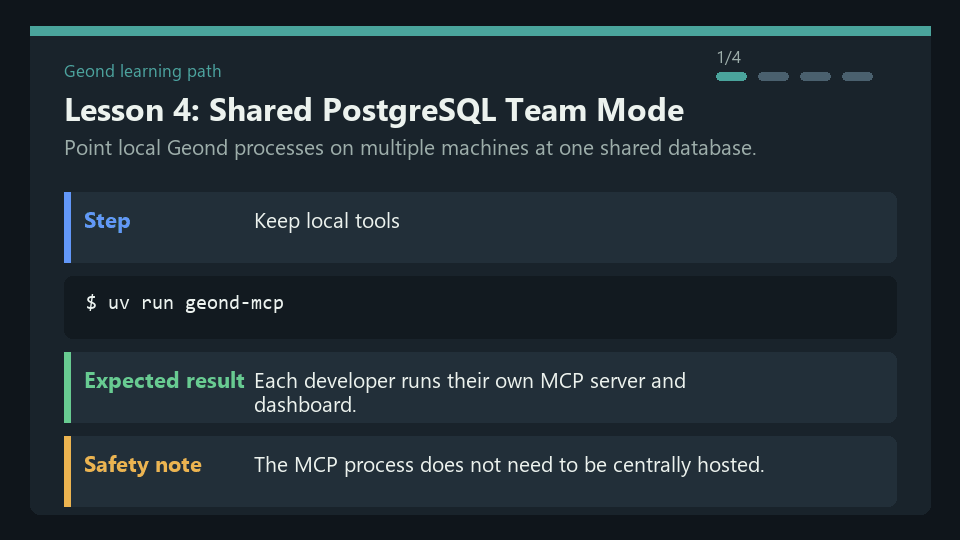

# Geond Learning Path

These notebooks turn the README scenarios into safe, repeatable lessons. They
use local/sample data by default and avoid private transcripts, live agent runs,
and cloud provisioning unless a lesson explicitly marks a step as opt-in.

## Prerequisites

- Python 3.11+
- `uv`
- Docker with Compose
- Git and ripgrep
- This repository checked out locally

Run from the repository root unless a notebook says otherwise.

## Lessons

| Lesson | Goal | Asset |
| --- | --- | --- |
| [01 Local Shared Memory](01_local_shared_memory.ipynb) | Start local Postgres, seed sample evidence, search memory, and smoke-test MCP. |  |
| [02 Handoffs And Reservations](02_handoffs_and_reservations.ipynb) | Use context review, reservations, conflicts, and handoffs before parallel edits. |  |
| [03 AI Pair Coding Workflow](03_ai_pair_coding_workflow.ipynb) | Let Agent A and Agent B share repo context across different tools. |  |
| [04 Shared PostgreSQL Team Mode](04_shared_postgres_team_mode.ipynb) | Understand optional shared PostgreSQL profiles for multi-PC collaboration. |  |

## Safety

- Do not paste real API keys, database passwords, or private transcript paths
  into notebooks.
- Keep keyword mode as the default when you do not want external embedding
  calls.
- Treat Azure/shared PostgreSQL provisioning as an opt-in team validation path,
  not part of the default local tutorial.

## Regenerate Assets

```bash
uv run python scripts/render_tutorial_assets.py
uv run python scripts/check_tutorial_notebooks.py
```

For the public README demo assets, see
[docs/public_demo_script.md](../docs/public_demo_script.md).
